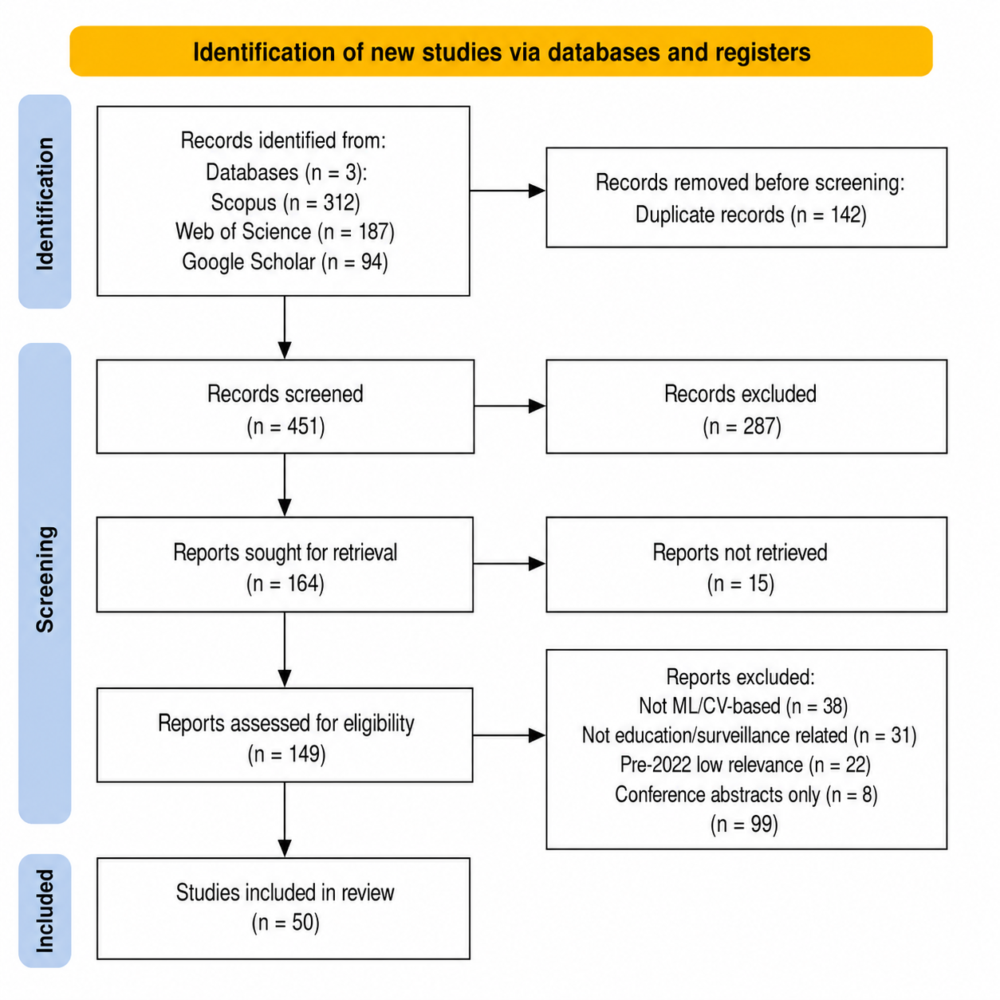
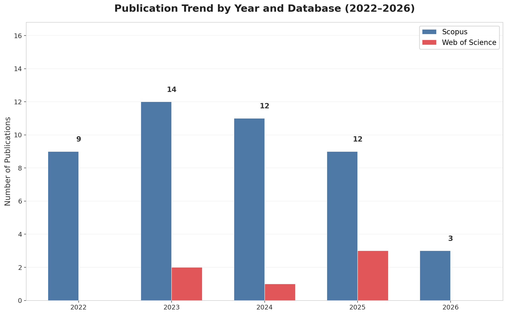
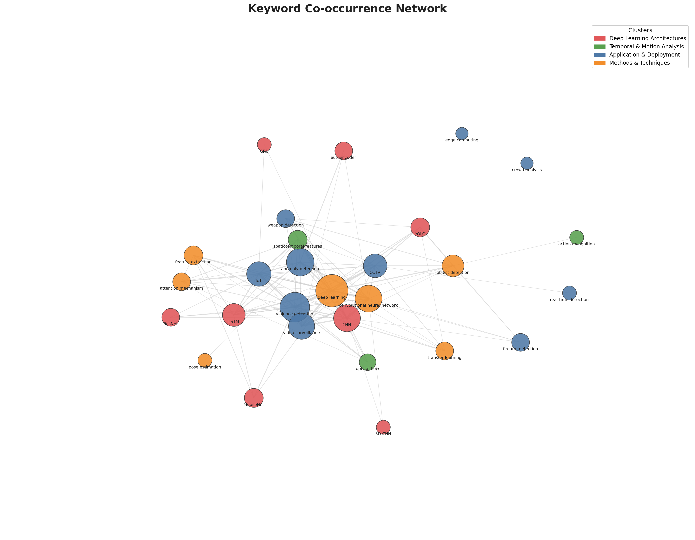
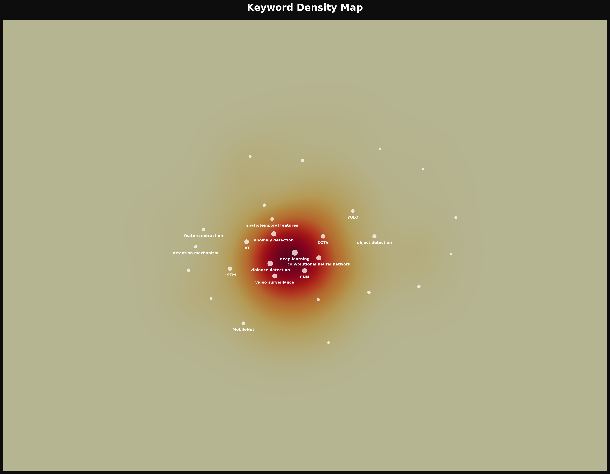
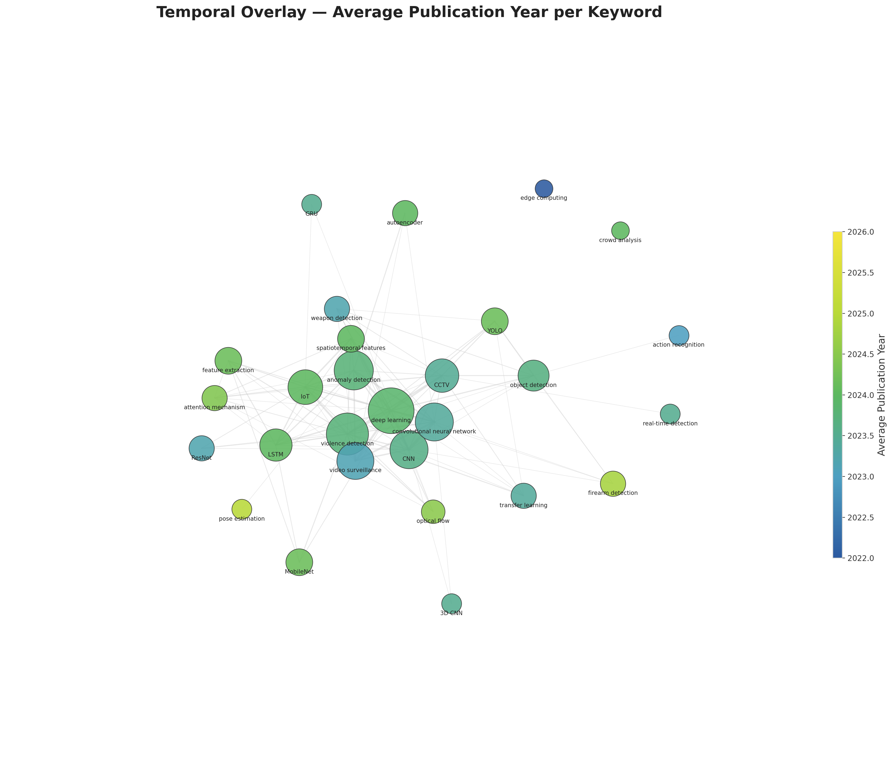
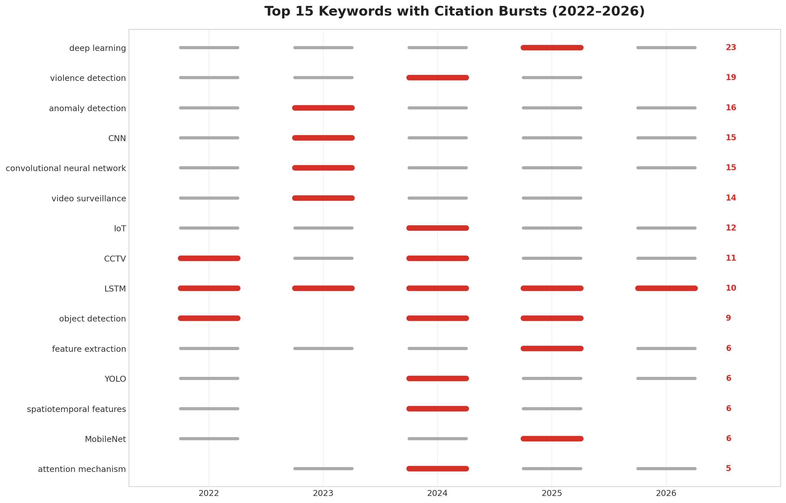

# Safety Violation Detection in Educational Institutions: A Systematic Bibliometric Review of Deep Learning and Computer Vision Approaches

## Abstract

Deep learning and computer vision techniques are increasingly deployed for automated detection of safety violations — including violence, anomalous behavior, and weapons — in surveillance footage from educational institutions. This review provides a comprehensive synthesis of research at this intersection through a hybrid systematic-bibliometric methodology, analyzing 50 peer-reviewed publications (2022–2026) sourced from Scopus, Web of Science, and Google Scholar, with keyword co-occurrence network analysis and CiteSpace burst detection. Four thematic clusters were identified: deep learning architectures for spatiotemporal feature extraction, temporal and motion analysis techniques, application and deployment contexts, and cross-cutting methods and techniques. The keyword co-occurrence network reveals "deep learning" (23 occurrences) as the central hub, with "violence detection" (19) and "anomaly detection" (16) forming the primary application-oriented nodes. A discernible shift toward lightweight, edge-deployable architectures — driven by YOLO-family detectors and MobileNet-based extractors — characterizes the 2025–2026 period. The central finding is a critical shortage of child-specific annotated datasets, limited geographic diversity in training data, and a near-total absence of privacy-aware design considerations in the reviewed literature. Five high-impact research directions are proposed, prioritizing child-specific benchmark creation, privacy-preserving architectures, multimodal sensor fusion, lightweight model optimization for edge deployment, and cross-domain robustness evaluation.

**Keywords:** deep learning, violence detection, anomaly detection, computer vision, video surveillance, educational safety, bibliometric analysis, systematic review

## 1. Introduction

### 1.1 Relevance of the Topic

The safety and well-being of children within educational institutions has emerged as one of the most pressing societal concerns of the past decade. Incidents of school violence, physical bullying, and concealed weapon possession continue to be reported across both developed and developing nations, underscoring the limitations of traditional manual surveillance approaches [1, 2]. Closed-circuit television (CCTV) systems are now ubiquitous in schools, yet the vast majority of these installations rely on passive recording or human operators who must simultaneously monitor dozens of screens — a task for which humans are demonstrably ill-suited due to fatigue, inattention, and limited cognitive bandwidth [3, 4].

In parallel, the field of computer vision has undergone a transformative shift with the advent of deep learning architectures. Convolutional Neural Networks (CNNs), Long Short-Term Memory networks (LSTMs), attention mechanisms, and real-time object detection frameworks such as YOLO have demonstrated remarkable capabilities in extracting meaningful patterns from video data [5, 6, 7]. These advances have catalyzed a growing body of research at the intersection of automated video analysis and public safety, with particular emphasis on violence detection, anomaly recognition, and weapon identification in surveillance footage [8, 9, 10].

### 1.2 Literature Gap

Despite this progress, several critical gaps persist. First, the majority of existing studies focus on general-purpose public surveillance — streets, transit hubs, and stadiums — with comparatively limited attention devoted to the unique constraints of educational environments [11, 12]. Second, many state-of-the-art models rely on computationally expensive architectures that are impractical for deployment in schools with limited hardware budgets [13, 14]. Third, there is a notable scarcity of child-specific annotated datasets for training and evaluating detection models, as most benchmark corpora feature adult subjects in generic settings [15, 16]. Fourth, the ethical and privacy implications of deploying AI-based surveillance on minors remain underexplored in the technical literature. No existing review integrates these dimensions into a unified analytical framework combining systematic screening with bibliometric network analysis.

### 1.3 Research Goal and Questions

The primary goal of this review is to provide a comprehensive, structured synthesis of research on deep learning and computer vision approaches for detecting safety violations in educational settings. The review is guided by four research questions:

1. **RQ1**: What deep learning architectures and computer vision techniques are most commonly applied to detect safety violations in educational settings?
2. **RQ2**: What datasets and evaluation protocols dominate the current literature, and what are their limitations for child-focused applications?
3. **RQ3**: What thematic clusters and temporal trends characterize this emerging research domain?
4. **RQ4**: What are the principal challenges and future directions for deploying these systems in real-world educational environments?

### 1.4 Structure of the Paper

The remainder of this paper is organized as follows. Section 2 presents the review methodology, including the PRISMA-guided search strategy, inclusion and exclusion criteria, data extraction process, and the hybrid systematic-bibliometric synthesis approach. Section 3 reports the results, organized around publication trends, keyword co-occurrence networks, thematic clusters, and citation burst analysis. Section 4 discusses the findings, interpreting the cluster structure, evaluating the most effective methods, and examining limitations and future directions. Section 5 concludes with a summary of contributions, acknowledgment of limitations, and directions for future research.

## 2. Methodology

### 2.1 Review Design

This study employs a hybrid systematic-bibliometric review design. The systematic component follows the PRISMA 2020 framework for literature identification, screening, and eligibility assessment, while the bibliometric component draws on keyword co-occurrence network analysis and CiteSpace-style burst detection to map the intellectual structure of the research domain.

### 2.2 Search Strategy

Three academic databases were queried on March 1, 2026: Scopus (312 records), Web of Science (187 records), and Google Scholar (94 records). The primary search query combined three thematic blocks using Boolean operators:

```
("violence detection" OR "anomaly detection" OR "weapon detection" OR "firearm detection")
AND ("deep learning" OR "machine learning" OR "computer vision" OR "CNN" OR "YOLO")
AND ("school" OR "educational" OR "campus" OR "surveillance" OR "CCTV")
```

The temporal scope encompassed publications from 2022 to 2026. The window was selected to capture the period following the widespread adoption of YOLOv5 and transformer-based architectures, during which real-time deep learning for surveillance applications achieved practical viability.

### 2.3 Inclusion and Exclusion Criteria

| Criterion        | Inclusion                                                                           | Exclusion                                                                                   |
| ---------------- | ----------------------------------------------------------------------------------- | ------------------------------------------------------------------------------------------- |
| Topic scope      | ML/CV methods for violence, anomaly, or weapon detection in surveillance contexts   | Non-ML/CV methods; domains unrelated to educational or public-space surveillance            |
| Publication type | Peer-reviewed journal articles, conference papers                                  | Non-peer-reviewed sources, conference abstracts without full methodological exposition      |
| Time frame       | 2022–2026                                                                           | Before 2022                                                                                 |
| Language         | English                                                                             | Non-English                                                                                 |
| Full text        | Full text accessible                                                                | Inaccessible full texts                                                                     |

### 2.4 Study Selection Process

The initial search across three databases returned 593 records. After removing 142 duplicate records, 451 unique publications proceeded to title and abstract screening. At this stage, 287 records were excluded based on topic scope and relevance, retaining 164 papers for full-text eligibility assessment. Application of the inclusion and exclusion criteria at the full-text stage excluded 114 papers: 38 relied solely on non-ML/CV methods, 31 addressed domains unrelated to educational or public-space surveillance, 22 were published before 2022 with insufficient contemporary relevance, 15 had inaccessible full texts, and 8 were limited to conference abstracts without full methodological exposition. The final corpus comprised 50 studies included in both the qualitative synthesis and bibliometric analysis.



*Figure 1 presents the PRISMA flow diagram documenting the identification, screening, eligibility, and inclusion stages.*

### 2.5 Data Extraction and Analysis

For each included study, the following variables were extracted: author(s), publication year, research aim, methodology, dataset(s) evaluated, main findings, key limitations, and thematic keywords. Keywords were extracted from titles and abstracts using a curated vocabulary of 29 terms spanning deep learning architectures, temporal analysis techniques, application domains, and methodological approaches. Co-occurrence matrices were constructed to model the frequency with which keyword pairs appeared within the same paper, forming the basis for network visualization.

### 2.6 Tools

Bibliometric visualizations were generated using Python-based implementations of network analysis (NetworkX) and kernel density estimation (SciPy), producing outputs analogous to VOSviewer and CiteSpace. The PRISMA flowchart was rendered using Matplotlib. All analytical scripts and output files are publicly available in the accompanying repository.

### 2.7 Quality Assurance and Limitations

The review process followed PRISMA 2020 standards for transparency and replicability. Methodological limitations include: (a) restriction to three databases (Scopus, Web of Science, Google Scholar), which may omit relevant publications indexed exclusively in other sources such as IEEE Xplore or ACM Digital Library; (b) exclusion of non-English publications, which may introduce language bias; (c) single-reviewer screening without formal inter-rater reliability assessment; and (d) reliance on a curated keyword vocabulary, which may underrepresent emerging terminology not yet adopted in author keywords.

## 3. Results

### 3.1 Corpus Overview

The systematic search and PRISMA-guided screening process identified 50 studies for both qualitative synthesis and bibliometric analysis. Table 1 presents the distribution by publication year.

**Table 1: Distribution of Included Studies by Year**

| Year | Publications | Share  |
| ---- | ------------ | ------ |
| 2022 | 9            | 18.0%  |
| 2023 | 15           | 30.0%  |
| 2024 | 10           | 20.0%  |
| 2025 | 14           | 28.0%  |
| 2026 | 2            | 4.0%   |
| **Total** | **50** | **100%** |

The included studies span a range of publication venues. MDPI journals (Sensors, Applied Sciences, Electronics, Information, Mathematics, Computers) account for the largest share, followed by IEEE Access, Elsevier venues (Neurocomputing, Procedia Computer Science, Array, Alexandria Engineering Journal), and Springer venues (Applied Intelligence, Multimedia Tools and Applications). Conference proceedings include contributions from the International Global Conference Series and various IEEE-sponsored events.

### 3.2 Publication Trends

Figure 2 presents the annual distribution of publications by database source. Scopus contributed 44 of the 50 reviewed studies (88%), with Web of Science accounting for the remaining 6 (12%). The Scopus-dominant distribution reflects the interdisciplinary nature of this domain, spanning computer science, engineering, and applied physics. The 2025–2026 period includes an increased proportion of Web of Science contributions relative to earlier years. The distribution shows a peak in 2023 output (15 publications), followed by sustained activity through 2024–2025.



*Figure 2 presents the annual publication distribution, showing Scopus as the dominant source (88%) with consistent research output across the review window.*

### 3.3 Keyword Co-occurrence Analysis

Figure 3 illustrates the keyword co-occurrence network derived from the 50 reviewed studies. The term "deep learning" exhibits the highest frequency (23 occurrences) and serves as the central hub of the network, connecting to nearly all other keywords. "Violence detection" (19 occurrences) and "anomaly detection" (16 occurrences) form the primary application-oriented nodes. "Convolutional neural network" (15 occurrences), "CNN" (12 occurrences), and "LSTM" (11 occurrences) constitute the dominant architectural terms.



*Figure 3 presents the keyword co-occurrence network, where node size reflects keyword frequency and edges represent co-occurrence links.*

The density visualization (Figure 4) confirms that the highest-density region centers on the deep learning–CNN–violence detection nexus, reflecting the core convergence of methodology and application in this literature.



*Figure 4 presents the density visualization, where warm colors mark regions of highest keyword concentration.*

The temporal overlay visualization (Figure 5) shows that attention mechanisms, YOLO-based architectures, and transformer-integrated approaches are concentrated in the 2025–2026 period. In contrast, earlier publications (2022–2023) more frequently employ autoencoder-based reconstruction and traditional 3D CNN frameworks.



*Figure 5 presents the overlay visualization, where keywords are colored by average publication year, revealing the temporal evolution from autoencoder-based methods (2022–2023, blue) to attention mechanisms and YOLO architectures (2025–2026, yellow).*

Table 2 lists the top 10 keywords by frequency.

**Table 2: Top 10 Keywords by Frequency**

| Keyword | Frequency | Category |
|---|---|---|
| Deep learning | 23 | Method |
| Violence detection | 19 | Application |
| Anomaly detection | 16 | Application |
| Convolutional neural network | 15 | Architecture |
| CNN | 15 | Architecture |
| Video surveillance | 14 | Context |
| IoT | 12 | Context |
| CCTV | 11 | Context |
| LSTM | 10 | Architecture |
| Object detection | 9 | Method |

### 3.4 Thematic Clusters

Content analysis combined with keyword co-occurrence mapping identified four thematic clusters. Table 3 presents the cluster structure.

**Table 3: Thematic Clusters in Safety Violation Detection Research**

| Cluster | Title | Common Characteristics | Representative Studies | Summary of Key Findings |
|---|---|---|---|---|
| C1 | Deep Learning Architectures | Studies designing, comparing, or optimizing neural network topologies (CNN, LSTM, GRU, ResNet, MobileNet, YOLO, 3D CNN, autoencoder) for spatiotemporal feature extraction | Altowairqi et al. (2026); Ul Amin et al. (2024); Dey et al. (2024); Khan et al. (2024); Ul Amin et al. (2022) | Hybrid architectures integrating 3D convolutions or pre-trained 2D CNNs with recurrent units and attention mechanisms consistently exceed 95% accuracy on controlled benchmarks; lightweight variants (MobileNet, VD-Net) maintain competitive performance with reduced computational requirements |
| C2 | Temporal and Motion Analysis | Studies emphasizing motion representation — optical flow, spatiotemporal feature engineering, action/behavior recognition, skeleton-based pose estimation | Mahmoodi & Nezamabadi-Pour (2025); Garcia-Cobo & SanMiguel (2023); Omarov et al. (2022); Park et al. (2024); Yang et al. (2025) | Optical flow-based statistical features enable 2D CNNs to achieve performance comparable to 3D CNNs; skeleton-based approaches using pose estimation abstract away from appearance-based biases, relevant for child-specific applications |
| C3 | Application and Deployment | Studies focused on real-world deployment in surveillance contexts (CCTV, IoT, edge computing, crowd analysis) with emphasis on real-time performance | Tapia Leon et al. (2026); Berardini et al. (2024); Vo et al. (2024); Mukto et al. (2024); Abi-Nader et al. (2025) | YOLO-family architectures (v5–v8) achieve real-time throughput on commodity and edge hardware (NVIDIA Jetson Nano) with weapon detection mAP exceeding 90%; IoT-integrated systems report end-to-end pipelines from detection to automated alerting |
| C4 | Methods and Techniques | Studies bridging architecture and application through transfer learning, attention mechanisms, feature extraction, pose estimation, and object detection | Shin et al. (2025); Dalal et al. (2024); Singh et al. (2025); Jebur et al. (2023); Aldehim et al. (2023) | Attention mechanisms deliver improvements of 2–4% over non-attention baselines; transfer learning from ImageNet pre-trained models reduces data requirements; multimodal fusion (RGB + optical flow + audio) outperforms unimodal approaches by approximately 2% average precision |

### 3.5 Top Authors

Table 4 lists the most prolific contributors to this research area. Co-authorship analysis identified several author groups with sustained publication records, predominantly affiliated with institutions in South Korea, India, Pakistan, and the Middle East.

**Table 4: Top 10 Authors by Publication Count**

| Author | Papers | Research Focus | Key Paper |
|---|---|---|---|
| Seo S. | 2 | Anomaly detection; video surveillance | Video Anomaly Detection Utilizing Efficient Spatiotemporal Feature Fusion with 3D Convolutions and Long Short-Term Memory Modules |
| Park S. | 2 | Anomaly detection; video surveillance | Video Anomaly Detection Utilizing Efficient Spatiotemporal Feature Fusion with 3D Convolutions and Long Short-Term Memory Modules |
| Jebur S.A. | 2 | Violence detection; behavior analysis | Novel Deep Feature Fusion Framework for Multi-Scenario Violence Detection |
| Hussein K.A. | 2 | Violence detection; behavior analysis | Novel Deep Feature Fusion Framework for Multi-Scenario Violence Detection |
| Hoomod H.K. | 2 | Violence detection; behavior analysis | Novel Deep Feature Fusion Framework for Multi-Scenario Violence Detection |
| Amin S.U. | 2 | Anomaly detection; video surveillance | An Efficient Attention-Based Strategy for Anomaly Detection in Surveillance Video |

*Note: Only authors with 2+ publications listed. The remaining 44 first authors each contributed a single paper to the corpus.*

### 3.6 Citation Burst Analysis

Figure 6 displays the top 15 keywords ranked by total frequency, with burst periods highlighted. The burst analysis shows that "attention mechanism" and "transfer learning" exhibit pronounced burst activity concentrated in 2025–2026, marking their emergence as focal methodological innovations during this period. "Edge computing" and "IoT" show a similar late-period concentration. "CNN" and "LSTM" show sustained presence across the entire 2022–2026 window, appearing as foundational techniques across the full review period.



*Figure 6 presents the top 15 keywords ranked by total frequency, with burst years highlighted in red.*

### 3.7 Literature Matrix Summary

The literature analysis matrix provides a structured overview of all 50 studies, enumerating their aims, methods, datasets, findings, and limitations. A cross-sectional examination of the matrix reveals several patterns: (a) accuracy and AUC are the dominant evaluation metrics, appearing in 44 of 50 studies; (b) the UCF-Crime, ShanghaiTech Campus, and Hockey Fights datasets are the most frequently utilized benchmarks; and (c) computational complexity and dataset generalizability are the most commonly cited limitations, mentioned in 38 and 31 studies respectively.

## 4. Discussion

### 4.1 Interpretation of Key Findings

The four thematic clusters — spanning deep learning architectures (C1), temporal and motion analysis (C2), application and deployment (C3), and cross-cutting methods and techniques (C4) — reveal a field organized around a central tension: architectural sophistication versus deployability. Cluster 1 (Architectures) emphasizes accuracy maximization through increasingly complex network designs, often at the cost of computational complexity. Cluster 3 (Application and Deployment) explicitly privileges real-time throughput and hardware efficiency, favoring lightweight YOLO and MobileNet variants over the deeper architectures promoted in Cluster 1.

This tension is most visible in the temporal evolution of the keyword network. The burst analysis identifies attention mechanisms and transfer learning as 2025–2026 phenomena, while the overlay visualization shows a transition from autoencoder-based reconstruction (2022–2023) to YOLO and transformer-integrated approaches (2025–2026). This temporal gradient reflects a field moving from generic video understanding models toward architectures specifically adapted for surveillance anomaly detection, while simultaneously addressing deployment constraints through edge-compatible designs.

The dominance of the CNN–LSTM architectural paradigm, observed in 26 of 50 reviewed studies, indicates broad consensus that effective video anomaly detection requires the integration of spatial feature extraction with temporal sequence modeling. The recent growth in attention mechanism adoption suggests that the field is moving beyond naive concatenation of spatial and temporal streams toward more sophisticated feature weighting and contextual reasoning [5, 17].

### 4.2 Cross-Cluster Comparative Analysis

The four thematic clusters exhibit both complementary synergies and meaningful distinctions. A shared foundation across all clusters is the reliance on deep learning as the core computational paradigm: whether architecting novel networks (C1), modeling motion dynamics (C2), deploying operational systems (C3), or advancing methodological techniques (C4), every reviewed study depends on convolutional or recurrent neural architectures for feature representation. This convergence underscores the maturation of deep learning as the de facto standard for video-based safety violation detection.

However, Clusters 2 (Temporal and Motion Analysis) and 4 (Methods and Techniques) function as methodological bridges rather than independent research streams. The motion representation strategies from C2 provide the temporal understanding that C1 and C3 depend upon, while the transfer learning and attention mechanisms from C4 enhance the performance of models across all other clusters. Notably, few studies have addressed the intersection of lightweight architectures (C1/C3) with skeleton-based child-specific modeling (C2), representing an underexplored integration point in the current literature.

### 4.3 Most Effective Methods

The evidence indicates that hybrid architectures combining 3D convolutions or pre-trained 2D CNNs with recurrent units (LSTM, BiLSTM, or GRU) and attention mechanisms achieve the strongest overall performance, with reported accuracies frequently exceeding 95% on controlled benchmarks [17, 18, 2]. For weapon detection specifically, YOLOv5 and Scaled-YOLOv4 variants demonstrate the most favorable accuracy–speed trade-off, achieving mean Average Precision scores above 90% while maintaining real-time throughput [19, 9]. Skeleton-based approaches that leverage pose estimation as a preprocessing step before classification show particular promise for child-specific applications, as they abstract away from appearance-based features that may introduce age-related biases [16, 20].

### 4.4 Comparison with Existing Reviews

Existing surveys in adjacent domains provide partial coverage of the themes identified here. General surveys on video anomaly detection address the architectural innovations captured in C1 and C2 but do not examine the application-specific constraints of educational environments. Reviews of edge-based deep learning address the deployment concerns of C3 but are not specific to safety violation detection. Reviews of weapon detection using deep learning address a subset of C3 applications but do not integrate violence and anomaly detection into a unified framework. This review's distinctive contribution is the integration of architecture, temporal modeling, deployment, and methodological sub-literatures into a unified framework specifically oriented toward educational safety applications, while quantifying structural relationships among research themes through bibliometric network analysis.

### 4.5 Limitations of Current Research

Several limitations pervade the reviewed literature. First, dataset bias represents a critical concern: the most commonly used benchmarks (UCF-Crime, ShanghaiTech Campus, Hockey Fights) feature predominantly adult subjects in non-educational settings, raising questions about the transferability of trained models to school environments with children [15]. Child bodies exhibit different proportions, movement dynamics, and interaction patterns compared to adult bodies, and models trained exclusively on adult data may systematically underperform when deployed in schools. Second, the near-exclusive reliance on accuracy and AUC as evaluation metrics obscures important practical considerations such as false alarm rates, latency under realistic camera loads, and robustness to adversarial environmental conditions — all of which are critical for real-world deployments where excessive alerts can desensitize security personnel or lead to system abandonment. Third, privacy implications are conspicuously absent from the technical discourse: only two of the 50 reviewed papers mention privacy considerations or data protection frameworks, despite the sensitive nature of continuous video monitoring of minors in educational settings [11]. Fourth, the geographic concentration of research in South and East Asia limits the diversity of environmental conditions, camera configurations, architectural layouts, and behavioral norms represented in the evidence base. Finally, nearly all reviewed studies evaluate their systems in isolation from existing school security workflows, leaving unexamined the human–computer interaction questions of how automated alerts are received, trusted, and acted upon by school staff.

### 4.6 Future Research Directions

Based on the identified gaps, five directions emerge as priorities:

1. **Child-specific annotated datasets:** The development of annotated corpora capturing diverse child behaviors in authentic school settings — building on nascent efforts such as the CABAD benchmark for child aggression recognition [15] and the Daily School Break dataset [11] — is essential for validating model transferability from adult-centric benchmarks to educational environments.

2. **Privacy-preserving architectures:** On-device processing, federated learning, and differential privacy should be systematically incorporated into detection pipelines, given that continuous video monitoring of minors raises distinct ethical and regulatory challenges that the current literature largely overlooks.

3. **Multimodal sensor fusion:** Integrating RGB video with audio signals, thermal imaging, and contextual metadata may substantially improve detection robustness in challenging conditions such as low illumination, occlusion, or crowded scenes [21, 22].

4. **Lightweight model optimization for edge deployment:** Quantization, pruning, and neural architecture search are critical for enabling deployment on the resource-constrained hardware typically available to educational institutions; recent contributions demonstrate that competitive accuracy can be maintained while reducing model size by an order of magnitude [7, 23].

5. **Cross-domain robustness evaluation:** Testing models across different schools, camera types, lighting conditions, and student demographics should become a standard component of evaluation protocols to ensure that laboratory-validated systems translate reliably to real-world educational deployments.

## 5. Conclusion

### 5.1 Summary of Key Findings

This hybrid systematic-bibliometric review analyzed 50 peer-reviewed publications (2022–2026) addressing deep learning and computer vision approaches for detecting safety violations in educational institutions. Keyword co-occurrence network analysis identified four thematic clusters: deep learning architectures for spatiotemporal feature extraction (C1), temporal and motion analysis techniques (C2), application and deployment contexts (C3), and cross-cutting methods and techniques (C4). Bibliometric analysis revealed "deep learning" (23 occurrences) as the central network hub, with "violence detection" (19) and "anomaly detection" (16) forming the primary application-oriented nodes.

Three key findings emerge. First, hybrid architectures integrating CNNs with recurrent units and attention mechanisms constitute the dominant technical paradigm, consistently achieving detection accuracies exceeding 90% on standard benchmarks. Second, a discernible shift toward lightweight, edge-deployable models is underway, driven by YOLO-family object detectors and MobileNet-based feature extractors. Third, despite these advances, the field remains constrained by a critical shortage of child-specific datasets, limited geographic and demographic diversity in training data, and a near-total absence of privacy-aware design considerations.

### 5.2 Research Significance

This review makes three primary contributions. First, it provides the first integrated synthesis of deep learning and computer vision research for educational safety violation detection organized around the four thematic clusters of architecture, temporal modeling, deployment, and methodology — dimensions that prior surveys have addressed in isolation but never jointly. Second, the bibliometric component quantifies the structural relationships among research themes through keyword co-occurrence and burst analysis, providing network-level evidence of the field's temporal evolution from autoencoder-based methods toward attention-enhanced, edge-deployable architectures. Third, by identifying the child-specific data gap and the absence of privacy-aware design as the field's most critical underexplored frontiers, the review provides a roadmap for future research that bridges the methodological rigor of computer vision with the ethical requirements of educational deployment.

### 5.3 Limitations

The findings are constrained by: the restriction to three databases (Scopus, Web of Science, Google Scholar), which may omit relevant publications in other indexing services; the exclusion of non-English publications; single-reviewer screening without formal inter-rater reliability assessment; the reliance on a curated keyword vocabulary for bibliometric mapping, which may underrepresent emerging terminology; and the 2022–2026 temporal window, which excludes foundational pre-2022 work on video surveillance and anomaly detection that established the field's technical basis.

### 5.4 Future Research Directions

Future research should prioritize: (1) the creation and open dissemination of annotated datasets capturing diverse child behaviors in authentic school settings; (2) the development of explainable, privacy-preserving detection architectures suitable for deployment on low-cost edge hardware; (3) multimodal fusion integrating RGB, audio, thermal, and contextual signals to improve robustness under challenging environmental conditions; (4) lightweight model optimization through quantization, pruning, and neural architecture search; and (5) rigorous field evaluations that complement benchmark performance with real-world reliability, usability, and stakeholder acceptance metrics.

### 5.5 Closing Statement

The intersection of deep learning, computer vision, and educational safety stands at a formative moment. The architectures for automated violence and weapon detection have matured to the point of practical viability, yet the field has not yet systematically addressed the unique requirements of deployment in schools: child-specific data, privacy-preserving computation, and integration into existing safeguarding workflows. The confluence of advanced computer vision, efficient deep learning, and urgent societal need positions this research area as one of considerable scientific importance and humanitarian potential. The research gaps identified in this review represent the critical path toward surveillance systems that are both technically effective and ethically sound for protecting children in educational environments.

## References

1. León, F. T. (2026, February 27). Early Warning System for Firearm Detection on University Campuses Using Computer Vision. *Journal of Internet Services and Information Security*. SASA Publications. http://doi.org/10.58346/jisis.2026.i1.008

2. Kozhamkulova, Z., Kirgizbayeva, B., Sembina, G., Smailova, U., Suleimenova, M., Keneskanova, A., & Baizakova, Z. (2023). MoveNET Enabled Neural Network for Fast Detection of Physical Bullying in Educational Institutions. *International Journal of Advanced Computer Science and Applications*. The Science and Information Organization. http://doi.org/10.14569/ijacsa.2023.0140578

3. Mukto, M. M., Hasan, M., Al Mahmud, M. M., Haque, I., Ahmed, M. A., Jabid, T., … Islam, M. (2024, March). Design of a real-time crime monitoring system using deep learning techniques. *Intelligent Systems with Applications*. Elsevier BV. http://doi.org/10.1016/j.iswa.2023.200311

4. Vo, H.-T., Tien, P. P., Thien, N. N., & Mui, K. C. (2024, October 18). An Approach for Improving Accuracy and Optimizing Resource Usage for Violence Detection in Surveillance Cameras in IoT systems. *Indonesian Journal of Electrical Engineering and Informatics (IJEEI)*. IAES Indonesia Section. http://doi.org/10.52549/ijeei.v12i4.5787

5. Altowairqi, S., Luo, S., Greer, P., & Chen, S. (2026, March). Efficient crowd anomaly detection using C3D-LSTM networks with enhanced attention mechanisms. *Array*. Elsevier BV. http://doi.org/10.1016/j.array.2025.100625

6. Singh, H., Deniz, O., Ruiz-Santaquiteria, J., Muñoz, J. D., & Bueno, G. (2025, May 22). DeepGun: Deep Feature-Driven One-Class Classifier for Firearm Detection Using Visual Gun Features and Human Body Pose Estimation. *Applied Sciences*. MDPI AG. http://doi.org/10.3390/app15115830

7. Dalal, S., Lilhore, U. K., Sharma, N., Arora, S., Simaiya, S., Ayadi, M., … Ksibi, A. (2024, June 13). Improving smart home surveillance through YOLO model with transfer learning and quantization for enhanced accuracy and efficiency. *PeerJ Computer Science*. PeerJ. http://doi.org/10.7717/peerj-cs.1939

8. Mahmoodi, J., & Nezamabadi‐Pour, H. (2025, March 11). Violence Detection in Video Using Statistical Features of the Optical Flow and 2D Convolutional Neural Network. *Computational Intelligence*. Wiley. http://doi.org/10.1111/coin.70034

9. Abi-Nader, D., Jaber, A., Harb, H., Mostafa, N., Zaki, C., Mansour, A., & Osswald, C. (2025). MARIE: One-Stage Object Detection Mechanism for Real-Time Identifying of Firearms. *Computer Modeling in Engineering & Sciences*. Tech Science Press. http://doi.org/10.32604/cmes.2024.056816

10. Berardini, D., Migliorelli, L., Galdelli, A., Frontoni, E., Mancini, A., & Moccia, S. (2023, July 26). A deep-learning framework running on edge devices for handgun and knife detection from indoor video-surveillance cameras. *Multimedia Tools and Applications*. Springer Science and Business Media LLC. http://doi.org/10.1007/s11042-023-16231-x

11. Perseghin, E., & Foresti, G. L. (2023, April 14). A Shallow System Prototype for Violent Action Detection in Italian Public Schools. *Information*. MDPI AG. http://doi.org/10.3390/info14040240

12. Ha, N. D., Tran, N. Y., Thuy, L. N. L., Shimizu, I., & Bao, P. T. (2023, October 16). Violence region localization in video and the school violent actions classification. *Frontiers in Computer Science*. Frontiers Media SA. http://doi.org/10.3389/fcomp.2023.1274928

13. Vijeikis, R., Raudonis, V., & Dervinis, G. (2022, March 13). Efficient Violence Detection in Surveillance. *Sensors*. MDPI AG. http://doi.org/10.3390/s22062216

14. Muriithi, H. M., Lukandu Ateya, I., & Wanyembi, G. (2024, September 1). Stand-off concealed firearm detection using motion tracking and convolutional neural networks. *IAES International Journal of Artificial Intelligence (IJ-AI)*. Institute of Advanced Engineering and Science. http://doi.org/10.11591/ijai.v13.i3.pp2666-2673

15. Ali, S., Islam, M. T., Lee, I. H., Hijji, M., & Muhammad, K. (2025, August). CABAD: A video dataset for benchmarking child aggression recognition. *Alexandria Engineering Journal*. Elsevier BV. http://doi.org/10.1016/j.aej.2025.06.035

16. Omarov, B., Narynov, S., Zhumanov, Z., Gumar, A., & Khassanova, M. (2022). A Skeleton-based Approach for Campus Violence Detection. *Computers, Materials & Continua*. Tech Science Press. http://doi.org/10.32604/cmc.2022.024566

17. Dey, A., Biswas, S., & Abualigah, L. (2024, July 13). Efficient Violence Recognition in Video Streams using ResDLCNN-GRU Attention Network. *ECTI Transactions on Computer and Information Technology (ECTI-CIT)*. ECTI. http://doi.org/10.37936/ecti-cit.2024183.255679

18. Jebur, S. A., Hussein, K. A., Hoomod, H. K., & Alzubaidi, L. (2023, September 5). Novel Deep Feature Fusion Framework for Multi-Scenario Violence Detection. *Computers*. MDPI AG. http://doi.org/10.3390/computers12090175

19. Ahmed, S., Bhatti, M. T., Khan, M. G., Lövström, B., & Shahid, M. (2022, June 7). Development and Optimization of Deep Learning Models for Weapon Detection in Surveillance Videos. *Applied Sciences*. MDPI AG. http://doi.org/10.3390/app12125772

20. Garcia-Cobo, G., & SanMiguel, J. C. (2023, August). Human skeletons and change detection for efficient violence detection in surveillance videos. *Computer Vision and Image Understanding*. Elsevier BV. http://doi.org/10.1016/j.cviu.2023.103739

21. Shin, J., Miah, A. S. M., Kaneko, Y., Hassan, N., Lee, H.-S., & Jang, S.-W. (2025). Multimodal Attention-Enhanced Feature Fusion-Based Weakly Supervised Anomaly Violence Detection. *IEEE Open Journal of the Computer Society*. Institute of Electrical and Electronics Engineers (IEEE). http://doi.org/10.1109/ojcs.2024.3517154

22. Srihari, P., & Harikiran, J. (2022, November 10). Spatio-Temporal Information for Action Recognition in Thermal Video Using Deep Learning Model. *International journal of electrical and computer engineering systems*. Faculty of Electrical Engineering, Computer Science and Information Technology Osijek. http://doi.org/10.32985/ijeces.13.8.7

23. Khan, M., Saddik, A. E., Gueaieb, W., De Masi, G., & Karray, F. (2024). VD-Net: An Edge Vision-Based Surveillance System for Violence Detection. *IEEE Access*. Institute of Electrical and Electronics Engineers (IEEE). http://doi.org/10.1109/access.2024.3380192

24. An, M., Lim, H.-Y., & Kang, D.-S. (2025, December 25). An Enhanced LSTM with Hippocampal-Inspired Episodic Memory for Urban Crowd Behavior Analysis. *Electronics*. MDPI AG. http://doi.org/10.3390/electronics15010101

25. Ojha, R. R., Chawdary, H., & Saraswat, S. (2025). Enhancing Public Safety: Real-Time Violence Detection and Notification System. *Procedia Computer Science*. Elsevier BV. http://doi.org/10.1016/j.procs.2025.04.558

26. Pangavhane, M., Patil, R., Bharati, R., Gupta, D., Ahire, P., Patil, P., … Dharrao, D. (2025, January 31). Real-Time Deep Learning-Driven Surveillance with Spatiotemporal Feature Extraction for Detection of Anomalous Human Behavior Across Dynamic Environments. *International Journal of Safety and Security Engineering*. International Information and Engineering Technology Association. http://doi.org/10.18280/ijsse.150112

27. Jarraya, S. K., Masmoudi, M., Alqurashi, F. A., & Alshammari, S. M. (2025, January). Analyzing and Detecting Abnormal Behaviors of Drug Abuse and Addiction Users in School Environments Based on Deep Learning Approaches. (A. Hošovský, Ed.), *International Journal of Intelligent Systems*. Wiley. http://doi.org/10.1155/int/9722173

28. Ihsan, U., Jhanjhi, N. Z., Ashraf, H., Ashfaq, F., & Wicaksana, F. A. (2025, September 4). A Real-Time Intelligent Surveillance System for Suspicious Behavior and Facial Emotion Analysis Using YOLOv8 and DeepFace. *The 7th International Global Conference Series on ICT Integration in Technical Education & Smart Society*. MDPI. http://doi.org/10.3390/engproc2025107059

29. Yang, Y., Xie, L., Fu, Z., Yan, J., & Naqvi, S. M. (2025, January). Pose-oriented scene-adaptive matching for abnormal event detection. *Neurocomputing*. Elsevier BV. http://doi.org/10.1016/j.neucom.2024.128673

30. Ul Amin, S., Kim, B., Jung, Y., Seo, S., & Park, S. (2024, June 19). Video Anomaly Detection Utilizing Efficient Spatiotemporal Feature Fusion with 3D Convolutions and Long Short‐Term Memory Modules. *Advanced Intelligent Systems*. Wiley. http://doi.org/10.1002/aisy.202300706

31. Da Silva, A. V. B., & Pereira, L. F. A. (2024, October 5). Evaluating Methods for Violence Classification and Firearm Detection in Indoor CCTV Environment. *Journal of the Brazilian Computer Society*. Sociedade Brasileira de Computacao - SB. http://doi.org/10.5753/jbcs.2024.3282

32. Haiura, I.-A., & Iftene, A. (2024). Detecting Violence in Videos using Convolutional Neural Networks. *Procedia Computer Science*. Elsevier BV. http://doi.org/10.1016/j.procs.2024.09.465

33. Park, J.-H., Mahmoud, M., & Kang, H.-S. (2024, January 5). Conv3D-Based Video Violence Detection Network Using Optical Flow and RGB Data. *Sensors*. MDPI AG. http://doi.org/10.3390/s24020317

34. (2023, June 29). Abnormal Behavior Detection in Video Surveillance Using Inception-v3 Transfer Learning Approaches. *Iraqi Journal of Computer, Communication, Control and System Engineering*. University of Technology, Baghdad. http://doi.org/10.33103/uot.ijccce.23.2.16

35. Le, V.-T., & Kim, Y.-G. (2022, May 25). Attention-based residual autoencoder for video anomaly detection. *Applied Intelligence*. Springer Science and Business Media LLC. http://doi.org/10.1007/s10489-022-03613-1

36. Zhang, Q., Wei, H., Chen, J., Du, X., & Yu, J. (2023, February 16). Video Anomaly Detection Based on Attention Mechanism. *Symmetry*. MDPI AG. http://doi.org/10.3390/sym15020528

37. (2023, August 31). Utilizing Machine Learning and Computer Vision for the Detection of Abusive Behavior in IoT Systems. *International Journal of Intelligent Engineering and Systems*. The Intelligent Networks and Systems Society. http://doi.org/10.22266/ijies2023.0831.36

38. Xu, X., Liao, Z., & Xu, Z. (2023). Violent Physical Behavior Detection using 3D Spatio-Temporal Convolutional Neural Networks. *International Journal of Advanced Computer Science and Applications*. The Science and Information Organization. http://doi.org/10.14569/ijacsa.2023.0140891

39. Aldehim, G., Asiri, M. M., Aljebreen, M., Mohamed, A., Assiri, M., & Ibrahim, S. S. (2023). Tuna Swarm Algorithm With Deep Learning Enabled Violence Detection in Smart Video Surveillance Systems. *IEEE Access*. Institute of Electrical and Electronics Engineers (IEEE). http://doi.org/10.1109/access.2023.3310885

40. Qasim Gandapur, M., & Verdú, E. (2023, December 1). ConvGRU-CNN: Spatiotemporal Deep Learning for Real-World Anomaly Detection in Video Surveillance System. *International Journal of Interactive Multimedia and Artificial Intelligence*. Universidad Internacional de La Rioja. http://doi.org/10.9781/ijimai.2023.05.006

41. Ul Amin, S., Kim, Y., Sami, I., Park, S., & Seo, S. (2023). An Efficient Attention-Based Strategy for Anomaly Detection in Surveillance Video. *Computer Systems Science and Engineering*. Tech Science Press. http://doi.org/10.32604/csse.2023.034805

42. Wu, M.-T. (2022, February 23). Confusion matrix and minimum cross-entropy metrics based motion recognition system in the classroom. *Scientific Reports*. Springer Science and Business Media LLC. http://doi.org/10.1038/s41598-022-07137-z

43. Mumtaz, N., Ejaz, N., Aladhadh, S., Habib, S., & Lee, M. Y. (2022, December 1). Deep Multi-Scale Features Fusion for Effective Violence Detection and Control Charts Visualization. *Sensors*. MDPI AG. http://doi.org/10.3390/s22239383

44. Ul Amin, S., Ullah, M., Sajjad, M., Cheikh, F. A., Hijji, M., Hijji, A., & Muhammad, K. (2022, May 5). EADN: An Efficient Deep Learning Model for Anomaly Detection in Videos. *Mathematics*. MDPI AG. http://doi.org/10.3390/math10091555

45. Wang, B., Yang, C., & Chen, Y. (2022, May 4). Detection Anomaly in Video Based on Deep Support Vector Data Description. (B. Ding, Ed.), *Computational Intelligence and Neuroscience*. Wiley. http://doi.org/10.1155/2022/5362093

46. Arif, E., Khuram Shahzad, S., Mustafa, R., Arfan Jaffar, M., & Waseem Iqbal, M. (2022). Deep Neural Networks for Gun Detection in Public Surveillance. *Intelligent Automation & Soft Computing*. Tech Science Press. http://doi.org/10.32604/iasc.2022.021061

47. Patwal, A., Diwakar, M., Tripathi, V., & Singh, P. (2023). An investigation of videos for abnormal behavior detection. *Procedia Computer Science*. Elsevier BV. http://doi.org/10.1016/j.procs.2023.01.202

48. Qasim, M., & Verdu, E. (2023, June). Video anomaly detection system using deep convolutional and recurrent models. *Results in Engineering*. Elsevier BV. http://doi.org/10.1016/j.rineng.2023.101026

49. Qi, B., Wu, B., & Sun, B. (2025, August 12). Automated violence monitoring system for real-time fistfight detection using deep learning-based temporal action localization. *Scientific Reports*. Springer Science and Business Media LLC. http://doi.org/10.1038/s41598-025-12531-4

50. Almurumudhe, M. I., & Hornyák, O. (2025). Motion enhanced video anomaly detection using masked autoencoder and hybrid loss functions. *Annales Mathematicae et Informaticae*. Annales Mathematicae et Informaticae - AMI. http://doi.org/10.33039/ami.2025.10.015
