## 2.4. Создать перечень статей в виде списка литературы (правильно оформить)

Правила: Автор(ы). (Год). Название статьи. Название журнала, том(номер), страницы. DOI

Пример:

Nurgaliyeva, S., Amangali, M., Basheyeva, Z., Kashkimbayeva, N., & Amantayev, D. (2025). Design and evaluation of an intelligent waste monitoring system based on RGIS integration for smart cities. Eastern-European Journal of Enterprise Technologies, 4(9), 70–78. Design and evaluation of an intelligent waste monitoring system based on RGIS integration for smart cities | Eastern-European Journal of Enterprise Technologies

Beisenbi М. А., & Basheyeva, Z. O. (2019). The analysis of control systems with a high potential for robust stability on the control object output. Journal of Mathematics, Mechanics and Computer Science, 103(3), 19–30. https://doi.org/10.26577/JMMCS-2019-3-23

## 3.1. Создайте матрицу литературы в файле Excel с помощью PROMT для каждой статьи по вашей исследовательской теме и сохраните ее как matrix_name.

SUPER PROMPT: Literature Analysis Matrix

` I am uploading a scientific article (PDF). Please read and analyze the article carefully and create a complete Literature Analysis Matrix in table format according to the instructions below. 🔹 1️⃣Table – Core Literature Extraction (with APA Reference) Extract and summarize the following information in concise, academic English. Present the results in a table with these columns: [Author(s), Year, Aim, Method, Participants, Main Findings, Key Limitations, Keywords, APA Reference] Guidelines: Use concise academic sentences (1–2 per cell). Extract information directly from the article (Abstract, Methods, Results, and Discussion). If any information is missing, write “Not specified.” Follow an academic Scopus-style tone and formatting. For the APA Reference, include: All authors’ surnames and initials, Publication year (in parentheses), Full article title (sentence case), Journal name (italicized), volume(issue), page range, and DOI (if available). Example format: Serik, M., Tleuzhanova, K., & Nurgaliyeva, S. (2025). Enhancing master’s-level STEM education through AI-driven IoT projects: A Kazakhstan experiment. International Journal of Information and Education Technology, 15(10), 745–753. https://doi.org/10.xxxxxx 🔹 2️⃣Notes for AI Output The table should be neatly formatted with borders and clear alignment. Ensure that each column is filled with relevant information extracted from the article. Maintain professional academic wording suitable for Scopus-level review writing. Goal: Produce a ready-to-use Literature Analysis Matrix that I can directly paste into my synthesis document. End your output with the line: ✅ Literature Analysis Matrix (with APA citation) successfully generated — ready for synthesis.`

## 3.2. Загрузите документ Excel с матрицей литературы и используйте PROMT для кластеризации и анализа тем на основе ИИ. Сохраните результат в документе Word. Сохраните его как cluster_name.

SUPER PROMPT: Thematic Clustering and Comparative Analysis

`I have completed my Literature Analysis Matrix based on multiple research articles. Using the information from that matrix, please perform an advanced thematic clustering and comparative synthesis according to the instructions below. 🔹 1️⃣Identify Thematic Clusters Analyze all entries in the literature matrix. Identify 3–5 key thematic clusters that logically group studies by their focus, methodology, or outcomes. For each cluster, provide: A concise title (2–4 words) that reflects its theme. The common characteristics uniting the studies (e.g., topic, methods, educational context). Representative studies (authors and years). A summary of key findings that define the cluster. Present this information in table format with the columns: [Cluster Title, Common Characteristics, Representative Studies, Summary of Key Findings] 🔹 2️⃣Cross-Cluster Comparative Analysis After creating the table, write a comparative analysis (250–300 words) describing: Similarities across clusters (e.g., shared theoretical approaches, similar findings). Differences (e.g., distinct methodologies, educational levels, regional focuses). Research Gaps — specify what is underexplored, methodologically weak, or missing. Use clear academic transitions (e.g., However, In contrast, Notably, Few studies have addressed…). 🔹 3️⃣Future Research Directions Conclude with 3–4 sentences (100–150 words) outlining what future studies should focus on, based on the gaps identified. Include ideas such as: Expanding to new educational levels or countries. Testing long-term or practical effects. Incorporating new technologies (e.g., generative AI, robotics integration, adaptive feedback). Developing comprehensive frameworks for pedagogy and practice. 🔹 Output Format 1✅⃣Table of Thematic Clusters (3–5 rows) 2✅⃣Comparative Analysis Paragraph (similarities, differences, gaps) 3✅⃣Future Research Recommendations (3–4 sentences) Maintain an academic Scopus-style tone (concise, analytical, evidence-based). End your response with the line: ✅ Thematic clustering and comparative synthesis successfully generated — ready for integration into the review results chapter.`

## 4.1. Скачай с официального сайта: ttps://www.vosviewer.com

## 4.2. Подготовка данных (самый важный шаг)

VOSviewer не собирает данные сам — их нужно заранее выгрузить из научной базы:

Scopus: Выполни поиск по своей теме Выдели все статьи → «Export» → выбери формат CSV или RIS → «Full record and cited references»
Web of Science: Аналогично → Export → «Plain text» или «CSV»

## 4.3. Запуск анализа в VOSviewer

`Открой программу и следуй мастеру: Create → Create a map based on bibliographic data Выбери источник: Scopus Web of Science RIS / CSV файл Выбери тип анализа: Co-authorship – анализ сотрудничества авторов Co-occurrence – ключевые слова и термины Citation – кто кого цитирует Co-citation – кто часто цитируется вместе Bibliographic coupling – общие ссылки в статьях Выбери единицы анализа: Authors (авторы) Organizations (университеты) Keywords (ключевые слова) Documents (статьи) Установи порог (например, минимум 5 цитирований или 3 повторения ключевого слова).`

## 4.4. Интерпретация визуализации

Когда карта построена, ты увидишь кластерную сеть: 🎨 Цвета кластеров – группы по тематике 🔵 Размер круга – важность узла (частота встречаемости) 🔗 Линии связи – связи между объектами (например, авторы, которых цитируют вместе) Можно переключать виды визуализации: Network visualization – сеть и связи Overlay visualization – динамика по времени (например, «новые» ключевые слова) Density visualization – плотность научного интереса

Анализ для статьи (на примере)

Библиометрический анализ выявил четыре основных исследовательских кластера, отражающих текущую ситуацию с интеграцией ИИ в STEM-образование. Первый кластер фокусируется на технологических основах, таких как машинное обучение и алгоритмы глубокого обучения. Второй кластер ориентирован на педагогику, делая акцент на разработке учебных программ и подготовке учителей для эффективного внедрения ИИ. Третий кластер подчеркивает растущее внимание к персонализации и адаптивным образовательным средам, а четвертый кластер исследует роль методов аналитики обучения и интеллектуального анализа данных в прогнозировании успеваемости учащихся.

## просмотри изображения

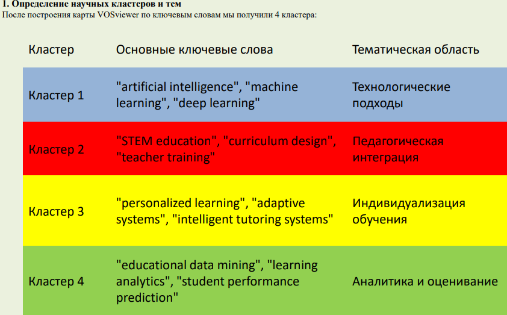
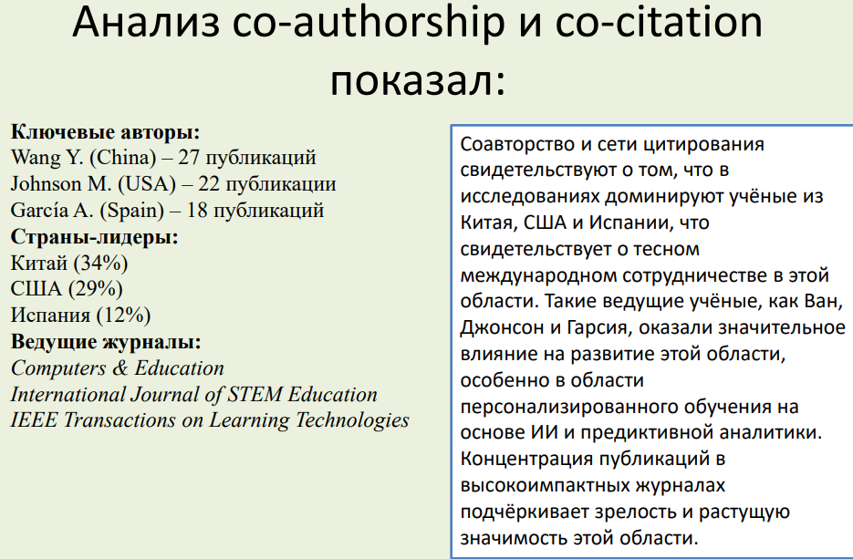
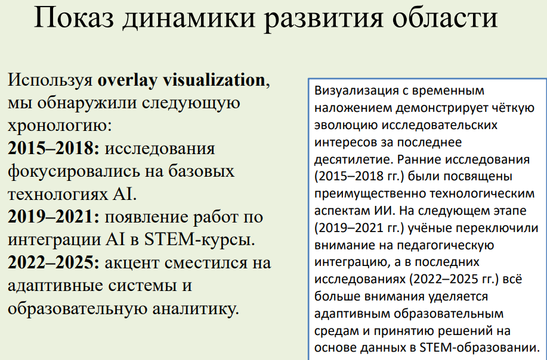
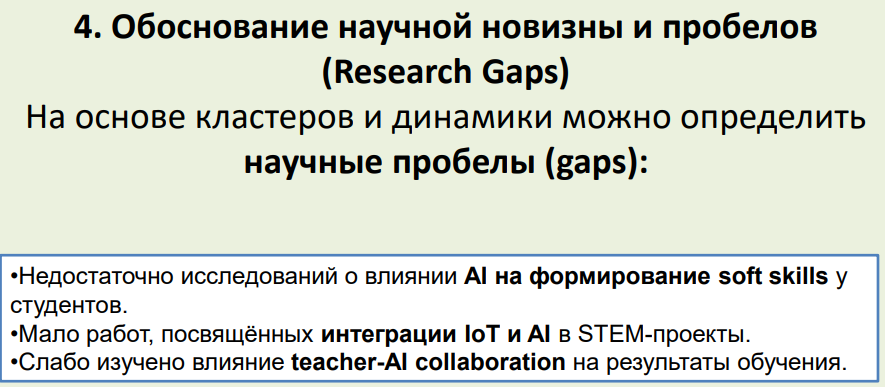
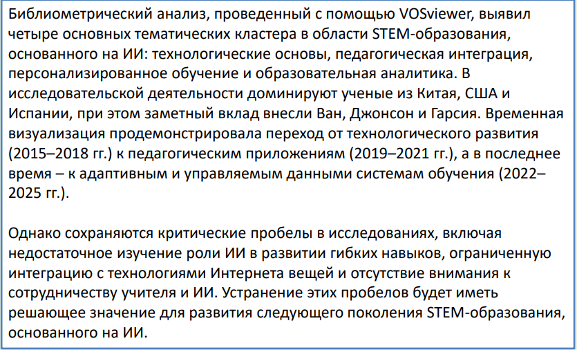

## 4.5. Провести анализ используя ПРОМТ (смотри пример)

ПРОМТ ДЛЯ АНАЛИЗА:

` Проведи профессиональную интерпретацию результатов библиометрического анализа на основе моей карты из VOSviewer (см. скриншот ниже). Структурируй текст в академическом стиле для статьи Scopus по следующему плану: 1.Identification of Clusters: •Назови 3–5 основных кластеров. •Перечисли ключевые слова (или страны/авторов) в каждом и дай им краткое тематическое название. •Объясни, какую научную область или тему отражает каждый кластер. 2.Research Trends: •Опиши динамику развития темы (например, от базовых исследований к прикладным, от технологий к педагогике и т.д.). •Укажи ключевые связи между кластерами и их научное значение. 3.Key Insights: •Назови ведущие страны / авторов / ключевые слова (в зависимости от выбранного анализа). •Объясни, что это говорит о глобальной структуре исследований. 4.Research Gaps: •Определи пробелы в исследованиях, которые пока недостаточно изучены. •Сформулируй 2–3 перспективных направления для будущих исследований. 5.Conclusion: •Подведи итоги и сделай вывод о том, как эти результаты помогают обосновать актуальность и новизну твоей темы исследования. ✍️ Пиши на академическом английском языке в стиле Scopus-журнала, избегая общих фраз. Объем: 250–400 слов.`

## 4.6 Итог

Сохраните результаты (фотографии/рисунки) различных видов анализа по данной теме (должно быть несколько, смотри пункт 4.3.).

## Сохранить в Word результаты Promt

## 5. Визуализируйте кластеры с помощью CiteSpace и анализируйте результаты.

## 5.1 Библиометрический обзор (Bibliometric Review) — это тип обзора, который анализирует количественные показатели исследований в конкретной научной области, выявляя тенденции их развития, ключевых исследователей, ключевые публикации и связи между ними.

Используемые инструменты: CiteSpace и VOSviewer.

CiteSpace

1 Установка

Установка CiteSpace CiteSpace работает на Java, поэтому сначала убедитесь, что у вас установлена Java (JDK 8 или выше). Шаги по установке: 1. Скачайте Java (если не установлена) с Download the Latest Java LTS Free . Нужно будет выбрать для Window или др.

Скачайте CiteSpace с официального сайта: CiteSpace Распакуйте архив и запустите CiteSpace (файл CiteSpace.exe для Windows или .jar для других ОС).

Когда запускаете программу, выйдет главный интерфейс. Здесь нужно нажать на кнопку AGREE.

2 Импорт

Импорт данных CiteSpace поддерживает данные из Web of Science (WoS), Scopus, PubMed и других источников. Шаги по импорту данных: •Загрузите данные из Web of Science или Scopus в формате .txt (для WoS) или .csv (для Scopus). •Откройте CiteSpace → File → Import/Export → Select Directory и выберите папку с файлами.

3 Настройка параметров анализа

Перед анализом выберите ключевые параметры. Базовые настройки: 1.Укажите временной диапазон (Time Slicing) – например, 2020-2025. 2.Выберите тип анализа (Node Types): •Author – анализ соавторов. •Keyword – анализ ключевых слов. •Institution – анализ организаций. •Country – анализ стран. 3.Выберите меру анализа (Selection Criteria), например: •Citation Bursts (всплески цитирования). •Betweenness Centrality (центральность в сети). G-index → например, k = 25 (уменьшите до 15, если сеть перегружена). Совет: Если CiteSpace выдаёт ошибку "exceeds the limit of this version (300)", уменьшите G-index или выберите меньше типов данных.

4 Построение и интерпретация сети

Нажмите кнопку "Go" Подождите, пока CiteSpace обработает данные (может занять несколько минут). В появившемся окне выберите "Visualize", чтобы открыть граф.

5 Сохранение и экспорт результатов

•Сохранение графика:

•File → Export → PNG/PDF.

•Для отчетов лучше использовать PNG формат.

---

## 5.2 СУПЕР-ПРОМТ ДЛЯ АНАЛИЗА ОТЧЁТА CITESCAPE

Ты — профессор с высоким индексом Хирша, эксперт по библиометрическому анализу и scientometrics, регулярно публикующий статьи в Scopus-журналах (Q1–Q3). Я загружаю стандартный Summary-отчёт CiteSpace. Твоя задача: на его основе подготовить профессиональный раздел статьи Results & Discussion в академическом стиле для Scopus-журнала. 📊 Структура анализа должна быть следующей: Structure of the Knowledge Domain – краткое описание общей структуры научного поля, количества кластеров, качества кластеризации (silhouette), и что это значит. Major Research Clusters – интерпретируй каждый из 5 крупнейших кластеров: опиши их тематику, смысл, эволюцию идей, ключевые статьи и их вклад. Citation Analysis – проанализируй наиболее цитируемые работы и объясни, что это говорит о ведущих направлениях исследований. Centrality and Sigma – интерпретируй статьи с высокой центральностью и их роль как «мостов» между темами. Объясни значение sigma как индикатора влияния. Burst Analysis – даже если значения равны 0.00, объясни, что это значит (например, стабильный интерес, отсутствие резких сдвигов и т.д.). Research Trends and Gaps – обобщи ключевые тренды, переходы в тематике исследований, выяви пробелы и перспективные направления. Conclusion – короткий вывод о текущем состоянии области и её будущем развитии. 📌 Требования: Стиль — академический, связный, уровень Scopus Q1/Q2. Используй переходные фразы и аналитический язык («this indicates that…», «the findings suggest…», «emerging research trends include…»). Не переписывай отчёт буквально — делай интерпретацию и аналитические выводы. Объём — 800–1200 слов.

## 5.3 ИТОГ

Визуализируйте как минимум 3 кластера по данной теме и сохраните изображения.
Соберите результаты promt запроса в документ Word.

## 5.4 Проверь примеры

tasks/Bibliometric Review_Citespace.pdf
tasks/Citespace.pdf

## 6. Systematic Review (PRISMA диаграмма и описание (1450 слов))

Systematic Review — это методологический обзор литературы, в котором анализируются и обобщаются существующие исследования по определённой теме. Основные отличия от обычного обзора литературы: Чёткий протокол (методика поиска, критерии включения/исключения). Обоснованный отбор (определённые базы данных и ключевые слова). Глубокий анализ данных (статистические и библиометрические методы).

Методология PRISMA для Systematic Review Что такое PRISMA? PRISMA — это четырехэтапный метод отбора научных статей, который включает: Identification (Идентификация) → Поиск публикаций. Screening (Отбор) → Исключение нерелевантных статей. Eligibility (Критерии включения/исключения) → Оценка по строгим критериям. Included (Включенные исследования) → Финальный список публикаций. Главная цель PRISMA → минимизировать предвзятость и обеспечить воспроизводимость обзора.

PRISMA Flow Diagram PRISMA обычно представляется в виде блок-схемы, показывающей, как статьи отбирались и исключались. Стандартная схема PRISMA включает 4 этапа: 1. Identification (Идентификация) Поиск публикаций в базах данных (Scopus, Web of Science, Google Scholar). Удаление дубликатов. 2. Screening (Отбор) Исключение нерелевантных исследований по заголовкам и аннотациям. 3. Eligibility (Критерии включения/исключения) Оценка полных текстов статей на соответствие теме обзора. 4. Included (Включенные исследования) Финальный набор статей для анализа.

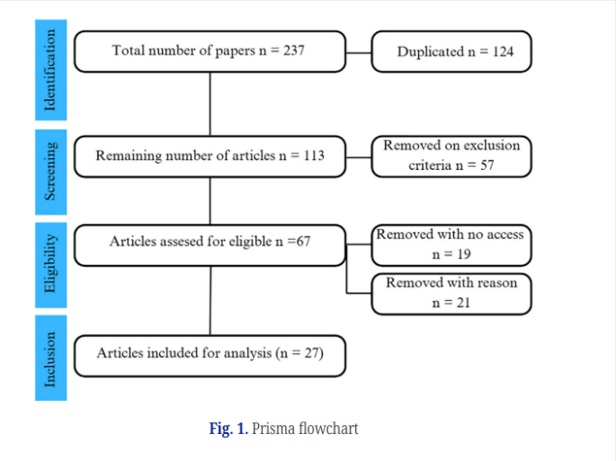
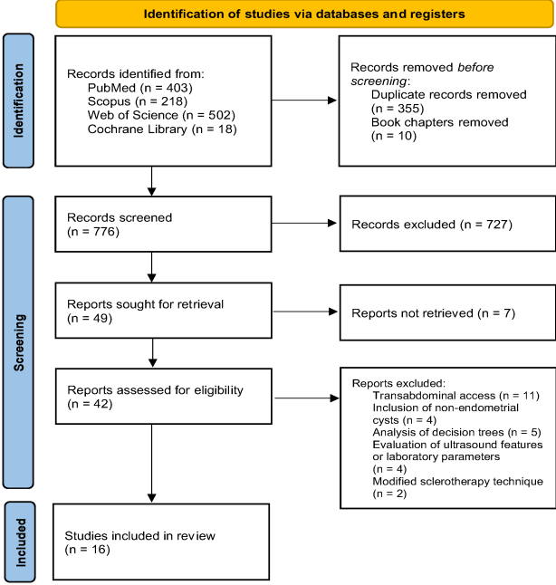
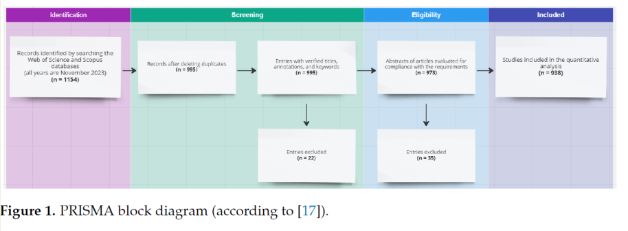

Пример текста методологии PRISMA: 1. Методологический процесс основан на стандартах PRISMA. Поиск публикаций проводился в Web of Science, Scopus и Google Scholar. Были использованы ключевые слова: "Quantum Computing", "Newtonian Methods", "Fixed-Point Iteration". В результате поиска выявлено 750 статей. После удаления дубликатов осталось 500. На этапе первичного отбора (screening) проанализированы заголовки и аннотации, оставив 250 релевантных работ. Полные тексты оценены по критериям включения/исключения, итоговый набор составил 100 статей для анализа. 2. На этапе предварительного отбора было загружено 750 записей из баз данных Web of Science, Scopus и Google Scholar. После удаления дубликатов с помощью Zotero и Microsoft Excel, 250 записей были исключены, поскольку дублировались в разных источниках. Итоговый набор данных для анализа составил 500 статей.

Как удалить лишние дубликаты? Web of Science (WoS) не удаляет дубликаты автоматически, поэтому вам нужно сделать это вручную до или после экспорта. Удаление дубликатов после экспорта (в Excel) Откройте экспортированный файл Web of Science (.XLSX) в Excel Выделите всю таблицу Перейдите в "Данные" → "Удаление дубликатов" Выберите ключевые столбцы для поиска дубликатов: Title (Название статьи) Authors (Авторы) DOI (уникальный идентификатор статьи) Нажмите ОК → Excel удалит все повторяющиеся статьи. Этот метод удобен, если у вас много загруженных данных.

Как удалить лишние дубликаты? Удаление дубликатов в Zotero Если работаете с большим объемом статей, используйте Zotero. Шаги в Zotero: Импортируйте Web of Science файл (.RIS, .BibTeX, .CSV) в Zotero. Перейдите в "Duplicate Items" (Дубликаты). Zotero автоматически покажет повторяющиеся статьи. Выберите "Merge", чтобы объединить их. Скачать и установить Zotero Zotero | Your personal research assistant

Как удалить лишние дубликаты?

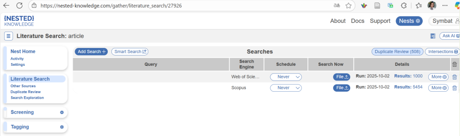

## 6.1

ОФОРМИТТЬ В ВОРД ДОКУМЕНТ

заполнить диаграмму PRISMA
написать описание
Описать методологию поиска и отбора статей: Какие базы данных использовались? Какие ключевые слова применялись? Какие критерии включения и исключения были установлены? Описать процесс удаления дубликатов: Какой метод использовали (Excel, Zotero)? Сколько статей было удалено? Подвести итог: Сколько статей осталось для анализа?

Пример: Методологический процесс основан на стандартах PRISMA. Поиск публикаций проводился в Web of Science, Scopus и Google Scholar. Были использованы ключевые слова: "Quantum Computing", "Newtonian Methods", "Fixed-Point Iteration". В результате поиска выявлено 750 статей. После удаления дубликатов осталось 500. На этапе первичного отбора (screening) проанализированы заголовки и аннотации, оставив 250 релевантных работ. Полные тексты оценены по критериям включения/исключения, итоговый набор составил 100 статей для анализа

## 7

Promt

Based on my research topic: [insert your topic here], perform a bibliometric-style summary of the scientific field. Using your general knowledge and analysis skills, generate the following outputs: 1️⃣Top 10 Authors Provide a list of the 10 most influential authors who have published research in this field. For each author, include: Full name Country or affiliation (if known) Approximate publication count 1–2 main research themes 1 key representative paper (title + year) Present the result in a table with columns: [Author, Country, Research Focus, Key Paper, Contribution Summary] 2️⃣Top 10 Keywords List the most frequent keywords or terms used in publications related to this topic. For each keyword, include: Its meaning or definition (1–2 sentences) Relevance to the topic (why it matters) Category (e.g., pedagogy, technology, methodology). Present the result in a table with columns: [Keyword, Definition, Relevance, Category] 3️⃣Thematic Summary (150–200 words) Write a short academic summary explaining: What trends emerge from the keywords and authors. Which directions are most active in current research. What gaps remain underexplored. Use an academic Scopus-style tone. End your output with the line: ✅ TOP 10 authors, keywords, and thematic trends successfully generated — ready for inclusion in the bibliometric overview section.

see all exmaples here:
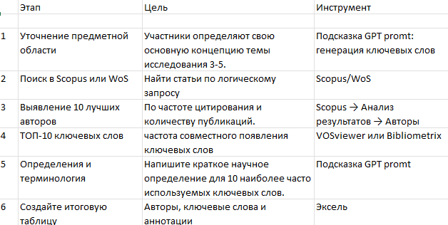
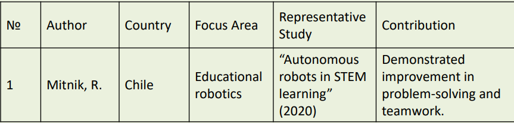
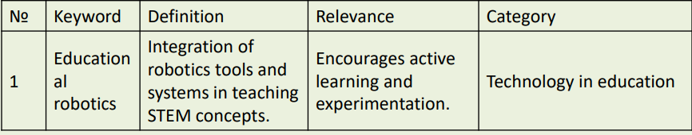
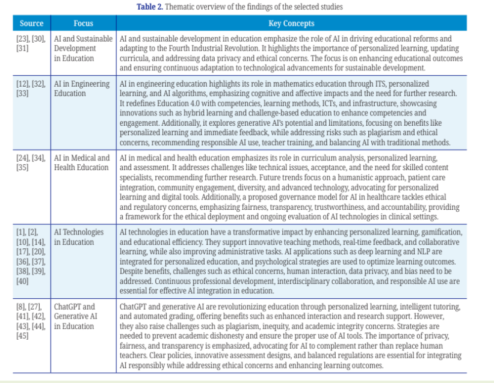
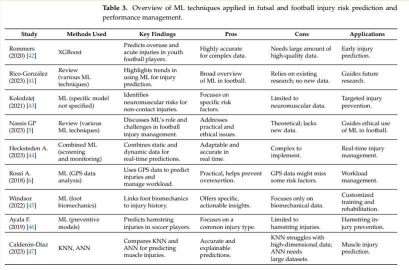
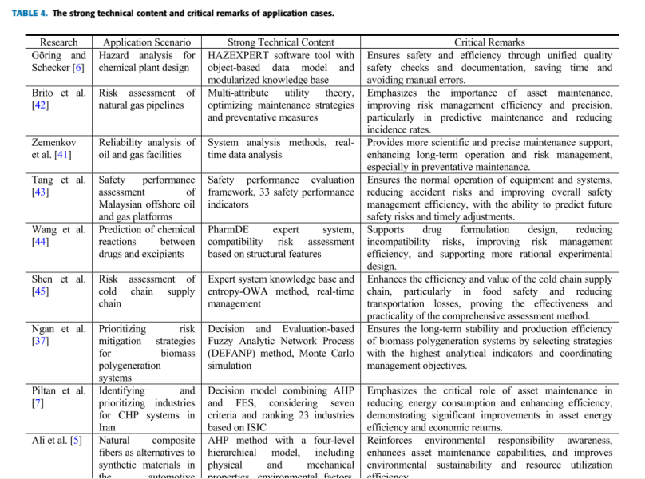
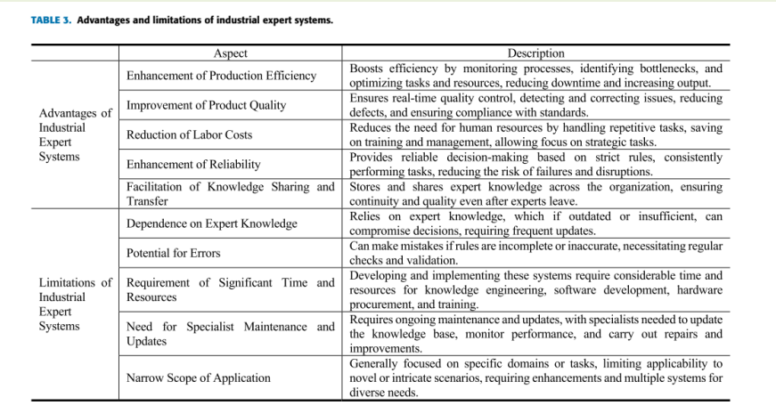
#7.1 Итог - ИТОГ - сделать таблицы по авторам и по терминам с соответствующими столбцами

## 8 -Пишем введение вашей обзорной статьи

## 8.1 ИТОГ, План работы

Выберите конкретный журнал для публикации статьи (ККСОН, Scopus).

Ознакомьтесь с требованиями.

Ознакомьтесь с содержанием вводной части.

Напишите вводную часть, используйте вспомогательные инструменты

Комментарии и события

## 8.2 Подсказки

Структура

Введение состоит из 4 ключевых элементов:

Актуальность темы Почему эта тема важна? Какова ее значимость в науке или на практике? Какие важные исследования уже были проведены по этой теме?

Определение границ исследования Какие аспекты будут рассмотрены? Какие методы или подходы используются?

Цель обзорной статьи Какие вопросы рассматриваются в статье? Каковы основные задачи?

Описание структуры статьи Какие разделы содержит статья и что в них рассматривается?

Словарь академических выражений для написания введения в обзорной статье
Описание актуальности темы Используйте эти выражения, чтобы объяснить, почему ваша тема важна. Общая важность темы: В последние годы наблюдается значительный рост интереса к … … остается одной из наиболее актуальных тем в современной науке. Развитие … открыло новые возможности в … В связи с увеличением … возросла необходимость изучения … Несмотря на значительные достижения в …, остаются нерешённые вопросы. Обоснование значимости исследования: Данный вопрос имеет как теоретическое, так и практическое значение, поскольку … Многие исследователи подчеркивают важность … в контексте … Современные исследования показывают, что … играет ключевую роль в … Анализ предыдущих работ свидетельствует о … Проблематика темы: Однако, несмотря на значительное количество исследований, остается ряд нерешенных вопросов, связанных с … Существующие подходы к … не всегда учитывают … Одной из главных проблем является … Разные исследования приводят к противоречивым выводам относительно … Важно отметить, что до сих пор недостаточно изучены …

Обзор существующих исследований (Литературный обзор) Эти фразы помогут вам корректно описать предыдущие работы. Представление ключевых исследований: Ранее проведенные исследования показали, что … В работах (Фамилия автора, год) было установлено, что … Исследование (Фамилия автора, год) выявило … Согласно (Фамилия автора, год), … играет важную роль в … В нескольких исследованиях (Фамилия автора, год) изучались … Сравнение и выявление недостатков предыдущих работ: Хотя несколько исследований рассматривали …, до сих пор остается неясным … В то время как исследование (Фамилия автора, год) подчеркивает …, другая работа (Фамилия автора, год) утверждает, что … Ряд исследований сосредоточены на …, однако их результаты не всегда сопоставимы из-за … Несмотря на многочисленные работы, посвященные …, все еще остается открытым вопрос о … Выявление пробелов в литературе: Однако в литературе отсутствуют исследования, которые … Большинство работ сосредоточены на …, но мало внимания уделено … Существует недостаточное количество эмпирических данных, подтверждающих … Хотя исследования показывают …, вопрос о … остается недостаточно изученным.

Формулирование целей исследования Используйте эти выражения, чтобы четко сформулировать цель вашей статьи. Формулировка основной цели: Основная цель данной обзорной статьи – … Настоящее исследование направлено на … В данной статье анализируются … Настоящая работа посвящена … Определение задач исследования: Для достижения поставленной цели в статье рассматриваются следующие вопросы: В данной статье будет изучено: … Исследование включает анализ … Основное внимание уделяется … Формулировка исследовательских вопросов: В данной работе мы пытаемся ответить на следующие вопросы: Как … влияет на …? Какие основные подходы существуют для …? В чем заключаются преимущества и недостатки …?

Описание структуры статьи Структура работы: Статья состоит из следующих разделов: … В первой части рассматриваются …, затем анализируются … Во второй части статьи описываются …, а в заключении представлены … Введение содержит …, обзор литературы посвящен …, в основной части анализируются …

ПРИМЕР использования Словаря: 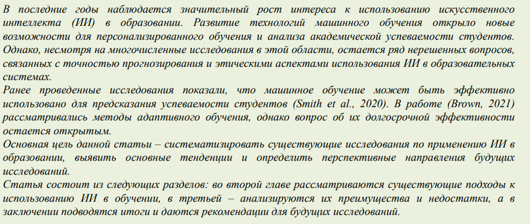

## 8.3 ИТОГ - введение в ворд файле

Напишите введение к вашей обзорной статье по выбранной теме. Сохраните структуру введения:

Описание актуальности темы

Краткий обзор предыдущих исследований

Формулирование цели и исследовательских вопросов

Описание структуры статьи

Формат - Word документ

Объем введения? •Если статья короткая (около 3000-5000 слов), введение ≈ 250-300 слов. •Если статья объемная (8000+ слов), введение ≈ 500-700 слов. Учитывайте требования журнала, в который планируете отправить статью.

Дополнительно: Если хотите проверить качество своего введения, используйте специальный промт в ChatGPT для анализа структуры!:

PROMT:

Пожалуйста, проанализируй структуру следующего раздела научной статьи [например, введение]. Проверь, соответствует ли он требованиям хорошей обзорной статьи. 1. **Актуальность темы** - Объясняется ли важность темы? - Указано ли, почему это исследование необходимо? 2. **Обзор существующих исследований** - Приведены ли ключевые источники? - Описано ли, какие исследования уже проводились и что они показали? - Есть ли анализ пробелов в литературе? 3. **Цель и задачи статьи** - Четко ли сформулирована цель исследования? - Указаны ли конкретные исследовательские вопросы? 4. **Методы и подходы (если применимо)** - Указано ли, какие методы были использованы? - Объяснены ли основные принципы анализа литературы? 5. **Структура статьи** - Описаны ли разделы статьи и что в них рассматривается? **Выведи анализ в формате:** - Что сделано правильно - Что можно улучшить - Рекомендации по исправлению

## 9 - пишем Методологию вашей обзорной статьи

## 9.1 Решить какой вид обзорной статьи вы будете писать

Систематический обзор (Systematic Review) – PRISMA
Библиометрический обзор (Bibliometric Review) Наукометрический обзор (или Scientometric Review) - табличная версия

## 9.2 Подразделы раздела Методология

Стратегия поиска (Іздеу стратегиясы, Search Strategy) Стратегия поиска описывает процесс выявления релевантной литературы, включая используемые базы данных, поисковые запросы и логические операторы. Ключевые элементы: Используемые базы данных: Указать, какие базы данных были использованы (например, Web of Science, Scopus, PubMed, IEEE Xplore, Google Scholar). Поисковые запросы: Указать ключевые слова и фразы, а также их синонимы. Пример: (“gamification in education” OR “game-based learning”) AND (“computer science teachers” OR “informatics teachers”) AND (“professional competence” OR “teacher training”) Логические операторы и фильтры: Объяснить, как использовались операторы AND, OR, NOT для уточнения поиска. Временной диапазон: Указать, за какой период были отобраны статьи (например, 2015–2025) и почему. Языковые ограничения: Указать, если рассматривались только статьи на английском языке. Пример предложения: "Был проведён всесторонний поиск в базах данных Web of Science, Scopus и IEEE Xplore с использованием следующих ключевых слов: «геймификация в образовании», «педагогика информатики» и «подготовка преподавателей». Были применены логические операторы (AND/OR) для уточнения результатов, а в анализ включены только статьи на английском языке, опубликованные в период с 2015 по 2025 годы."

Критерии отбора (Таңдау криетерийлері, Selection Criteria) Раздел Критерии отбора объясняет, по каким принципам статьи включались или исключались из обзора. Ключевые элементы: Критерии включения (Inclusion Criteria): Описание критериев, которым должны соответствовать статьи. Пример: Исследования, посвящённые геймификации в подготовке преподавателей Работы, фокусирующиеся на преподавателях информатики Рецензируемые научные статьи Критерии исключения (Exclusion Criteria): Определение того, какие исследования не были включены. Пример: Работы, не относящиеся к образованию и профессиональному развитию Исследования, посвящённые геймификации вне академической среды Нерецензируемые источники (например, блоги, мнения) Пример предложения: "В обзор включались исследования, рассматривающие роль геймификации в подготовке преподавателей, особенно преподавателей информатики. Исключались нерецензируемые статьи, исследования, не относящиеся к педагогике, а также работы, посвящённые геймификации вне образовательного контекста."

Оценка качества (Сапаны бағалау, Quality Assessment) Раздел Оценка качества описывает, как анализировалась надёжность и достоверность включённых исследований. Ключевые элементы: Инструменты оценки: Указать, какие методики использовались (например, PRISMA). Критерии оценки: Основные факторы включают: • Четкое описание цели исследования. • Полнота данных о методологии. • Наличие статистического анализа. • Репрезентативность выборки. • Возможность повторного использования результатов. Система оценки: Указать, использовалась ли шкала оценки (например, низкое, среднее, высокое качество). Пример предложения: "Качество каждого исследования оценивалось с использованием PRISMA Checklist. Статьи, содержащие недостаточное описание методологии или не имеющие четких выводов, классифицировались как низкокачественные. Работы с высоким уровнем научной строгости и доказательной базы считались надежными.

посмотри 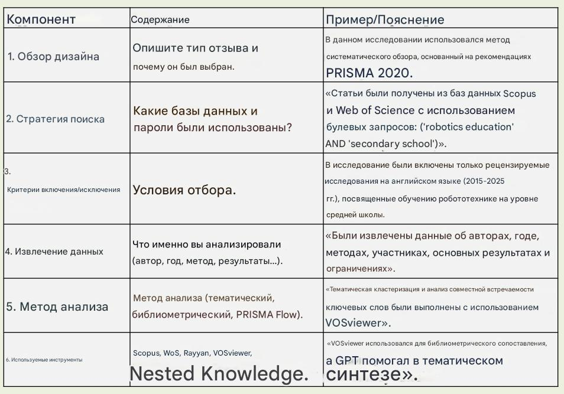

## 9.3 промт для проверки корректности

PROMPT 1 — METHODOLOGY CHECK I am submitting the Methodology section of my review article for detailed evaluation. Please analyze it according to academic and PRISMA standards. 🔹 1️⃣Structure and Completeness Does the section clearly specify: Type of review (Systematic / Scoping / Bibliometric)? Databases used (Scopus, WoS, ERIC, etc.)? Search strategy and Boolean operators? Inclusion and exclusion criteria? Data extraction process? Data analysis or synthesis methods (e.g., thematic, bibliometric, PRISMA flow)? Tools or software used (VOSviewer, Nested Knowledge, GPT, Rayyan)? 🔹 2️⃣Transparency and Replicability Can another researcher replicate this methodology based on the provided details? Are all steps of the PRISMA workflow traceable (Identification → Screening → Inclusion)? 🔹 3️⃣Academic Quality Assess the clarity, objectivity, and precision of descriptions. Evaluate the balance between qualitative and quantitative explanation. Check if terminology (e.g., “inclusion criteria,” “data extraction”) is used correctly. 🔹 4️⃣Recommendations Identify any missing elements or unclear descriptions. Suggest how to strengthen rigor, clarity, or reproducibility. Finish your feedback with: ✅ Overall verdict: Excellent / Good / Needs improvement — with a short justification (2–3 sentences).

## 9.4 примеры Review design

проверь:
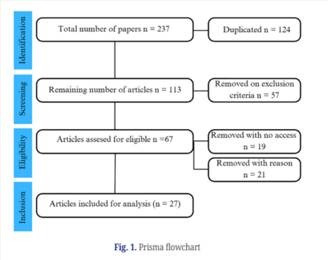
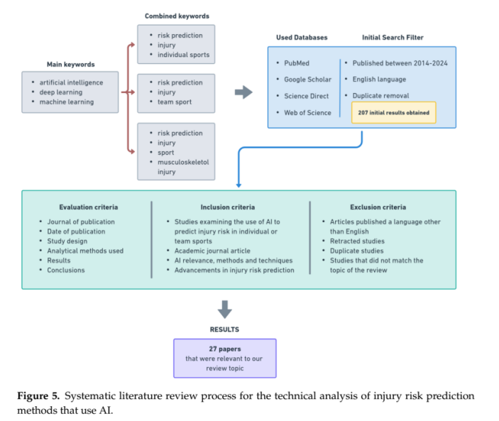
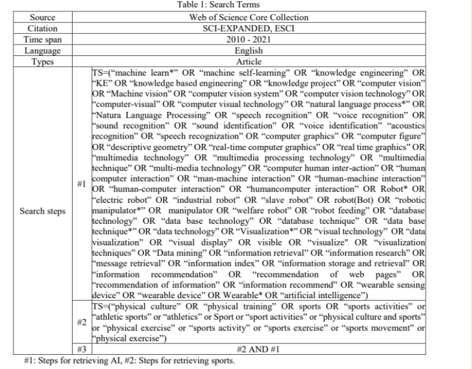
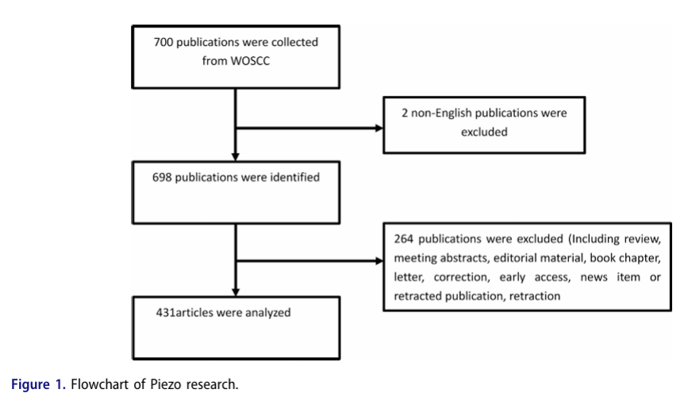
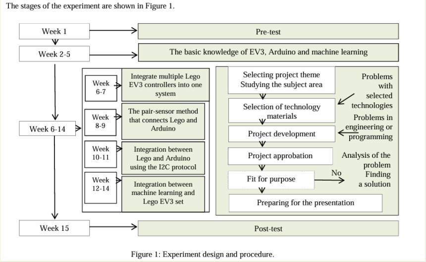

## 9.5 ИТОГ - методология в ворд документе

Напишите полный раздел «Методология» объемом 250–300 слов. Обязательные элементы должны включать:

Review design (Systematic/Scoping/Bibliometric)

Databases used (Scopus, Web of Science, ERIC и др)

Search strategy (с примерами Boolean query )

Inclusion/Exclusion criteria

Data extraction variables

Analysis tools (VOSviewer, Nested Knowledge)

Quality assurance (PRISMA стандарт, reproducibility).

## 10 - пишем раздел Результаты

## 10.1 Важно

Результаты --- Только факты

Раздел Results описывает не интерпретацию, а то, что реально обнаружено при анализе литературы (или при библиометрическом анализе, если он есть).

Запрещенные слова: suggests, indicates, implies, contributes, highlights, Demonstrates. Эти слова указывают на пояснения - Раздел обсуждения.

Слова для Results: • shows • presents • identifies • lists • includes • illustrates

Вы НЕ придумываете — вы ОПИСЫВАЕТЕ то, что уже создано инструментами предыдущих недель:

ВЫ: Создали матрицу литературы

Систематизировали темы по направлениям

Сформировали кластеры с помощью CiteSpace

Построили карты ключевых слов в VOSviewer

Определили тренды, burst keywords, co-citation связи

Определили топ 10 авторов, топ 10 keywords

Используйте графики, таблицы, диаграммы для наглядного представления данных. Добавляйте подписи и пояснения к каждому графику или таблице.

Пример:

В Таблице 1 представлено время реакции водителей в зависимости от различных факторов.

На Рисунке 1 показаны уровни риска, рассчитанные интеллектуальной системой

проверь:
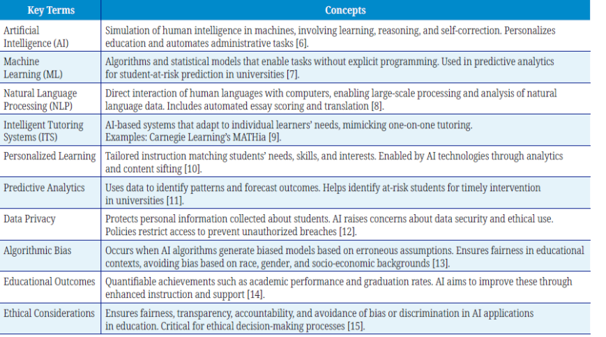
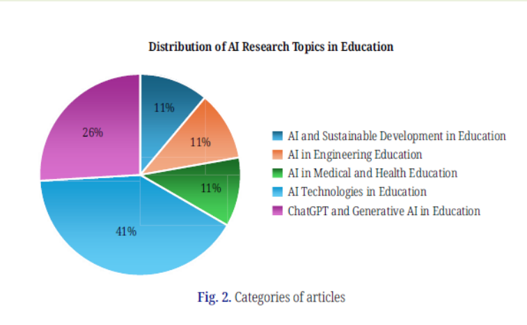
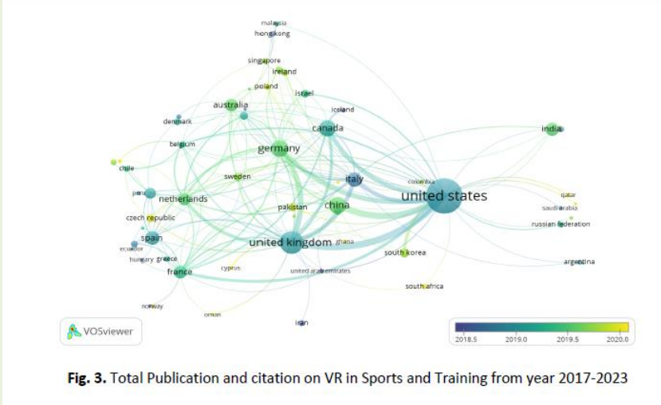
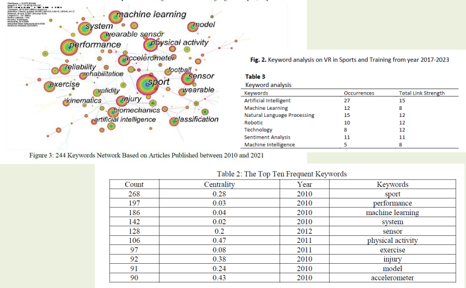
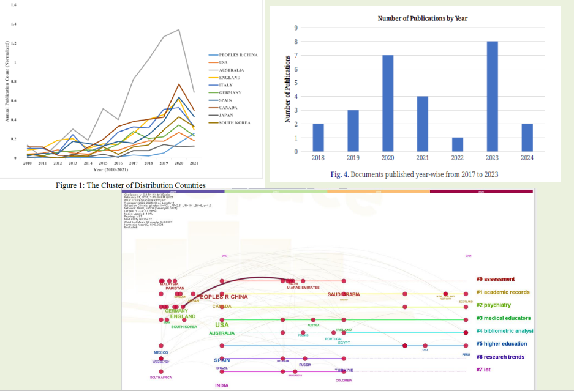
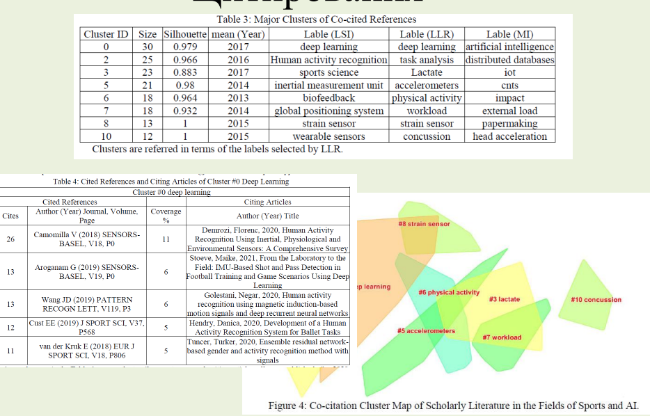
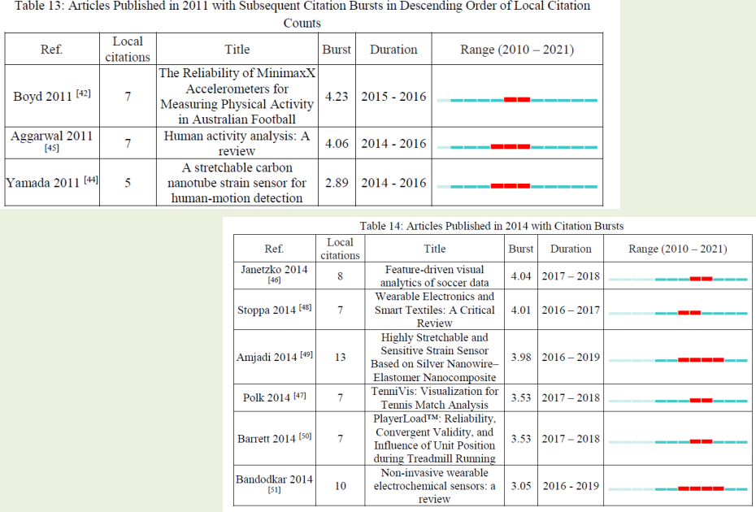
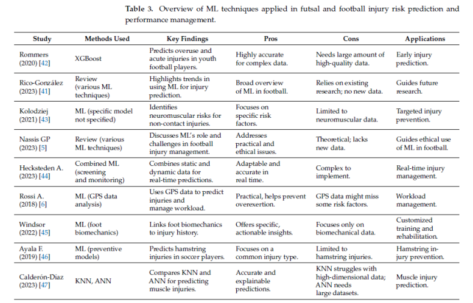

## 10.2 Итог - написать раздел Результат согласно выбранной модели - ворд файл

Задание.

• Представьте полученные данные в ясной и структурированной форме используя МОДЕЛЬ!

• Используйте таблицы, диаграммы или графики для наглядного представления данных.

• Не включайте интерпретацию или анализ, только описание полученных результатов.

проверь:

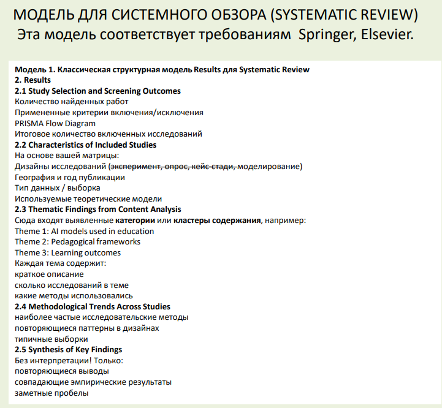
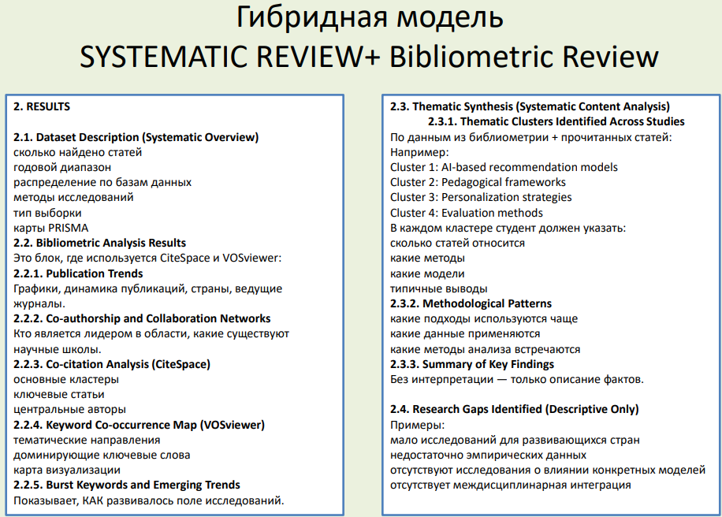

## 11 Задание 11 - пишем раздел Discussion

## 11.1 Важно

Раздел Discussion — самый концептуальный и аналитический элемент научной статьи.

Если Results отвечают на вопрос “Что мы нашли?”, то Discussion отвечает на вопросы: “Почему это важно?” “Как это соотносится с существующими знаниями?” “Что наши результаты добавляют в науку?” “Какие ограничения?” “Что делать дальше?”

Цель раздела — интерпретация полученных данных, их сравнение с литературой и выявление вклада исследования.

## 11.2 подсказки

проверь каждый из:
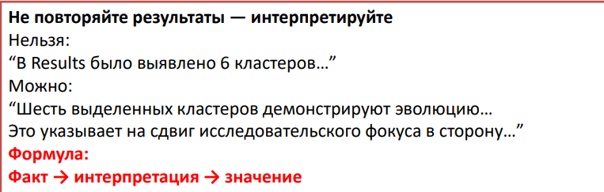
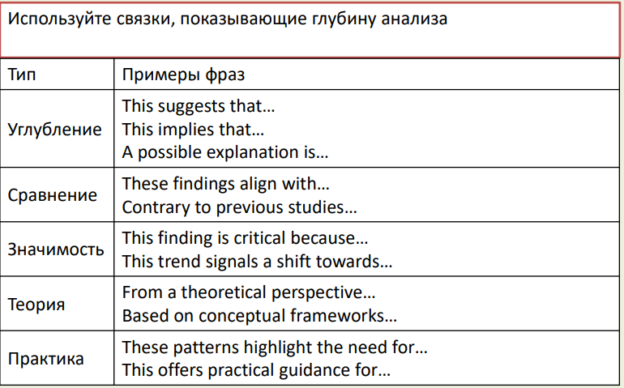
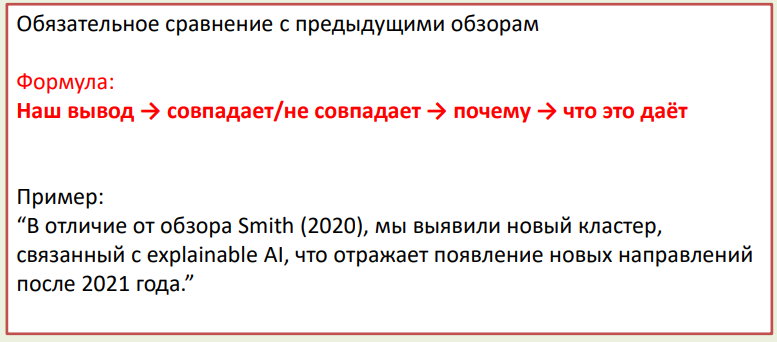
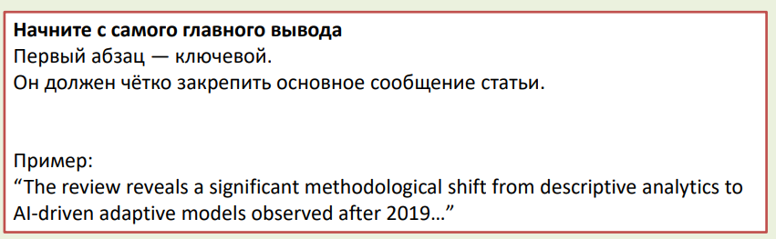
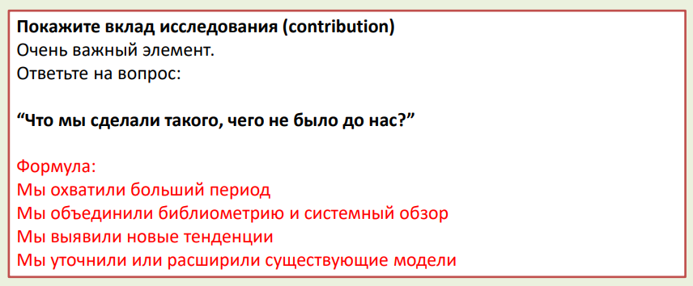
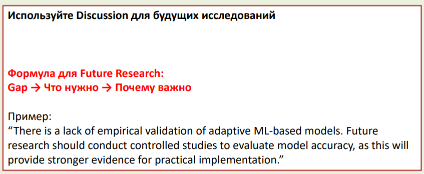
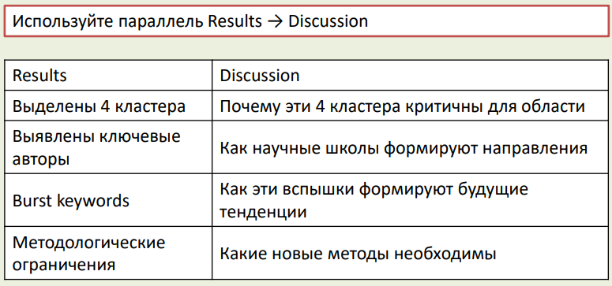

## 11.3 ИТОГ - написать раздел - ворд файл

Задание.

• Используйте предложенные фразы, лайфхаки для написания собственного раздела «Обсуждение» по вашему исследованию.

• Включить ссылки на литературные источники.

## 11.4 Чек лист качества и Промт

Промт:

Пожалуйста, оцени раздел "Discussion" в следующем тексте. Проверь, соответствует ли он академическим стандартам и включает ли ключевые элементы: Краткий обзор ключевых результатов Интерпретацию значимости данных Сравнение с предыдущими исследованиями Обсуждение ограничений исследования Перспективы для будущих исследований Дополнительно: Обрати внимание на логическую связанность текста. Предложи улучшения, если какой-то раздел слабый или недостаточно аргументирован. Оцени стиль изложения: Является ли текст академически строгим, избегает ли субъективных суждений? Ответ предоставь в структурированном виде с комментариями к каждому пункту и рекомендациями по улучшению.

чеклист: 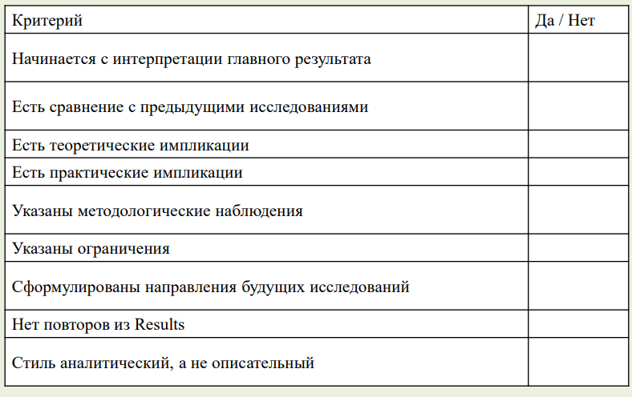

## 12 - пишем Заключение

Важно
Раздел Conclusion — это финальное обобщение, которое отвечает на три ключевых вопроса: Что было сделано? Какие ключевые выводы? Почему это важно для науки и практики? Очень важно: Conclusion не повторяет Results и Discussion, а обобщает и усиливает их основные идеи

Рекомендуемая структура раздела Conclusion

Краткое обобщение основных результатов

Укажите основную цель обзора и ключевые результаты исследования. Покажите, какие ключевые тенденции были выявлены. Подчеркните значимость работы для данной предметной области.

Примеры формулировок: В данном обзоре проведен систематический анализ эволюции... Наши результаты подчеркивают ключевые тенденции в... Анализ выявил два основных направления развития в области...

Кратко напомнить: цель обзора, что было исследовано, какие методы использовались (systematic + bibliometric). Это 2–3 предложения максимум.

Первое предложение Conclusion должно быть сильным: Пример: “This review provides an integrated systematic and bibliometric synthesis that clarifies the conceptual, methodological, and technological evolution of AI-driven learning systems.”

Обсуждение значимости и практического вклада

Как обзор способствует научному сообществу? Что статья добавляет в научную дисциплину? новая классификация уточнение теоретических рамок выявление новых научных школ интеграция систематического и библиометрического анализа • Какие ключевые технологии или концепции были определены? • Насколько обзор может повлиять на будущие исследования или практическое применение?

Примеры формулировок: Полученные результаты представляют ценную информацию о... Выводы подчеркивают растущую значимость... Исследование демонстрирует возрастающую роль искусственного интеллекта в...

Важно: не перечислять детали, не повторять раздел Results.

Ограничения исследования

Какие факторы ограничивают полноту исследования? • Какие аспекты требуют более глубокого изучения? • Какие проблемы, связанные с данными, методологией или интерпретацией, существуют?

Примеры формулировок: Несмотря на значимость полученных данных, настоящее исследование имеет определенные ограничения, включая... Основными ограничениями являются доступность данных, интерпретация моделей и... Следует учитывать, что объем проанализированных источников может повлиять на полноту выводов... Важно: не углублять — одно предложение на каждый пункт.

Направления для будущих исследований

Какие новые перспективные направления можно развить? • Какие методологии могут улучшить результаты? • Какие междисциплинарные подходы могут быть полезны?

Примеры формулировок: Дальнейшие исследования должны быть сосредоточены на... Будущие работы могут уточнить влияние... Совместные исследования с представителями других дисциплин позволят...

Future Research должен быть логически связан с Results

Не вводить новые идеи. Использовать только выявленные пробелы.

Итоговая заключительная мысль

Закончите обзор обоснованным утверждением, которое подчеркивает значимость темы. Можно упомянуть потенциал развития технологий и их влияние на общество.

Примеры формулировок: Синтез искусственного интеллекта и [области исследования] открывает значительные перспективы для... Современные достижения в области [технологии] продолжат трансформировать... По мере развития технологий новые вызовы и возможности будут формировать будущее...

Напиши раздел по структуре

Проверь по критериям

